**Sistema Web para el Inventario, Ventas y Control de Reservas de Canchas de Tejo y Mesas de Billar** 

**Autor:** 

**Jhoan Sebastián Sierra Perdomo** 

**Florencia - Caquetá 2025 II** 

**Contenido** 

1. [Introducción .......................................................................................................................... 14 ](#_page13_x69.00_y72.00)
1. [Propósito ....................................................................................................................... 14 ](#_page13_x69.00_y107.00)
1. [Ámbito del Sistema ....................................................................................................... 14 ](#_page13_x69.00_y326.00)
1. [Definiciones, Acrónimos y Abreviaturas ...................................................................... 15 ](#_page14_x69.00_y295.00)
1. [Referencias .................................................................................................................... 17 ](#_page16_x69.00_y153.00)
1. [Visión General del Documento ..................................................................................... 17 ](#_page16_x69.00_y366.00)
2. [Descripción General.............................................................................................................. 18 ](#_page17_x69.00_y72.00)
1. [Perspectiva del Producto ............................................................................................... 18 ](#_page17_x69.00_y107.00)
1. [Funciones del Producto ................................................................................................. 18 ](#_page17_x69.00_y412.00)
1. [Gestión de Inventario ............................................................................................ 18 ](#_page17_x69.00_y481.00)
1. [Registro de Ventas................................................................................................. 19 ](#_page18_x69.00_y113.00)
1. [Control de Mesas y Canchas ................................................................................. 19 ](#_page18_x69.00_y348.00)
1. [Manejo de Caja ..................................................................................................... 20 ](#_page19_x69.00_y113.00)
1. [Gestión de Usuarios .............................................................................................. 20 ](#_page19_x69.00_y267.00)
1. [Reportes ................................................................................................................ 20 ](#_page19_x69.00_y381.00)
3. [Características de los usuarios ...................................................................................... 20 ](#_page19_x69.00_y535.00)
1. [Administrador ....................................................................................................... 20 ](#_page19_x69.00_y637.00)
1. [Usuarios Futuros ................................................................................................... 21 ](#_page20_x69.00_y181.00)
4. [Restricciones ................................................................................................................. 21 ](#_page20_x69.00_y368.00)
4. [Suposiciones y Dependencias ....................................................................................... 22 ](#_page21_x69.00_y113.00)
4. [Requisitos a Futuro ....................................................................................................... 23 ](#_page22_x69.00_y168.00)
4. [Entrevista ...................................................................................................................... 23 ](#_page22_x69.00_y609.00)

[2.7.1.  Entrevista a Carolina Perdomo (Propietaria) ........................................................ 24 ](#_page23_x69.00_y72.00)

8. [Transcripción de la Entrevista....................................................................................... 25 ](#_page24_x69.00_y72.00)

[2.8.1.  Carolina ................................................................................................................. 25 ](#_page24_x69.00_y101.00)

3. [Requisitos .............................................................................................................................. 28 ](#_page27_x69.00_y72.00)
1. [Requisitos Funcionales ................................................................................................. 28 ](#_page27_x69.00_y107.00)
1. [Requisitos No Funcionales ........................................................................................... 32 ](#_page31_x69.00_y72.00)
1. [Especificación de Requisitos Funcionales .................................................................... 33 ](#_page32_x69.00_y466.00)
1. [Especificación de Requisitos No Funcionales .............................................................. 56 ](#_page55_x69.00_y72.00)
4. [Casos de Uso ......................................................................................................................... 62 ](#_page61_x69.00_y72.00)
1. [Diagramas ..................................................................................................................... 62 ](#_page61_x69.00_y107.00)
1. [Módulo de Autenticación ...................................................................................... 62 ](#_page61_x69.00_y137.00)
1. [Módulo de Usuarios .............................................................................................. 62 ](#_page61_x69.00_y429.00)
1. [Módulo de Roles ................................................................................................... 63 ](#_page62_x69.00_y72.00)
1. [Módulo de Inventario ............................................................................................ 64 ](#_page63_x69.00_y72.00)
1. [Módulo de Caja ..................................................................................................... 64 ](#_page63_x69.00_y485.00)
1. [Módulo de Mesas de Billar y Canchas de Tejo ..................................................... 65 ](#_page64_x69.00_y72.00)
7. [Módulo de Ventas ................................................................................................. 66 ](#_page65_x69.00_y72.00)
7. [Módulo de Reportes .............................................................................................. 66 ](#_page65_x69.00_y428.00)
7. [Módulo de Configuración ..................................................................................... 67 ](#_page66_x69.00_y72.00)
2. [Especificación de Casos de Uso ................................................................................... 67 ](#_page66_x69.00_y341.00)
1. [Módulo de Autenticación ...................................................................................... 67 ](#_page66_x69.00_y377.00)
1. [Módulo de Usuarios .............................................................................................. 73 ](#_page72_x69.00_y147.00)
1. [Módulo de Roles ................................................................................................... 80 ](#_page79_x69.00_y468.00)
1. [Módulo de Inventario ............................................................................................ 88 ](#_page87_x69.00_y236.00)
1. [Módulo de Caja ................................................................................................... 100 ](#_page99_x69.00_y655.00)
1. [Módulo de Mesas de Billar y Canchas de Tejo ................................................... 106 ](#_page105_x69.00_y566.00)
1. [Módulo de Ventas ............................................................................................... 124 ](#_page123_x69.00_y533.00)
1. [Módulo de Reportes ............................................................................................ 135 ](#_page134_x69.00_y367.00)
1. [Módulo de Configuración ................................................................................... 144 ](#_page143_x69.00_y72.00)
5. [Modelado del Sistema ......................................................................................................... 150 ](#_page149_x69.00_y72.00)
1. [Diagrama de Arquitectura ........................................................................................... 150 ](#_page149_x69.00_y133.00)
1. [Usuario / Cliente ................................................................................................. 151 ](#_page150_x69.00_y72.00)
1. [Frontend (Next.js, React, TypeScript) ................................................................ 151 ](#_page150_x69.00_y171.00)
1. [Backend (API NestJS) ........................................................................................ 152 ](#_page151_x69.00_y118.00)
1. [Prisma ORM ....................................................................................................... 153 ](#_page152_x69.00_y465.00)
1. [Base de Datos (PostgreSQL y MongoDB) ......................................................... 154 ](#_page153_x69.00_y97.00)
6. [Infraestructura con Docker Compose ................................................................. 155 ](#_page154_x69.00_y159.00)
6. [Flujo General de Interacción ............................................................................... 156 ](#_page155_x69.00_y72.00)
2. [Diagrama de Clases..................................................................................................... 156 ](#_page155_x69.00_y433.00)
1. [Gestión de Usuarios, Roles y Permisos .............................................................. 157 ](#_page156_x69.00_y336.00)
1. [Gestión de Mesas, Usos y Tarifas ....................................................................... 159 ](#_page158_x69.00_y153.00)
1. [Inventario y Movimientos ................................................................................... 161 ](#_page160_x69.00_y72.00)
1. [Ventas y Detalles ................................................................................................. 162 ](#_page161_x69.00_y492.00)
1. [Auditoría ............................................................................................................. 163 ](#_page162_x69.00_y405.00)
3. [Diagrama de Despliegue ............................................................................................. 164 ](#_page163_x69.00_y72.00)
1. [Usuario (Navegador Web) .................................................................................. 166 ](#_page165_x69.00_y97.00)
1. [Docker Host (Servidor Local o VPS) ................................................................. 166 ](#_page165_x69.00_y272.00)
1. [Contenedor Frontend – Next.js (Puerto 3200) .................................................... 167 ](#_page166_x69.00_y72.00)
1. [Contenedor Backend – NestJS API (Puerto 4200) ............................................. 167 ](#_page166_x69.00_y503.00)
1. [Prisma ORM ....................................................................................................... 168 ](#_page167_x69.00_y446.00)
1. [Contenedor PostgreSQL – Puerto 5433 .............................................................. 169 ](#_page168_x69.00_y186.00)
1. [Flujo General del Sistema ................................................................................... 170 ](#_page169_x69.00_y72.00)
4. [Diagrama de Actividades ............................................................................................ 171 ](#_page170_x69.00_y72.00)
1. [Flujo de Uso de Mesa / Cancha .......................................................................... 171 ](#_page170_x69.00_y101.00)
1. [Flujo de Venta Rápida ......................................................................................... 173 ](#_page172_x69.00_y72.00)
1. [Flujo de Venta por Uso ....................................................................................... 174 ](#_page173_x69.00_y72.00)
4. [Flujo de Movimiento de Inventario .................................................................... 175 ](#_page174_x69.00_y72.00)
5. [Modelo Entidad Relación ........................................................................................... 176 ](#_page175_x69.00_y72.00)
1. [Schema Auth ....................................................................................................... 177 ](#_page176_x69.00_y130.00)
1. [Schema Core ....................................................................................................... 178 ](#_page177_x69.00_y292.00)
1. [Schema Mesas ..................................................................................................... 179 ](#_page178_x69.00_y227.00)
1. [Schema Inventario .............................................................................................. 181 ](#_page180_x69.00_y199.00)
1. [Schema Ventas .................................................................................................... 182 ](#_page181_x69.00_y464.00)
1. [Schema Public ..................................................................................................... 184 ](#_page183_x69.00_y183.00)
1. [Integridad Referencial del Modelo ..................................................................... 184 ](#_page183_x69.00_y604.00)
1. [Almacenamiento NoSQL para logs y auditoría extendida.................................. 186 ](#_page185_x69.00_y72.00)
6. [Diagrama de Grafo de Navegación ............................................................................. 186 ](#_page185_x69.00_y287.00)
1. [Autenticación ...................................................................................................... 187 ](#_page186_x69.00_y618.00)
1. [Mesas y Canchas ................................................................................................. 188 ](#_page187_x69.00_y158.00)
1. [Inventario ............................................................................................................ 189 ](#_page188_x69.00_y97.00)
1. [Ventas .................................................................................................................. 189 ](#_page188_x69.00_y472.00)
1. [Reportes .............................................................................................................. 190 ](#_page189_x69.00_y158.00)
1. [Configuración ..................................................................................................... 190 ](#_page189_x69.00_y418.00)
1. [Usuarios y Roles ................................................................................................. 191 ](#_page190_x69.00_y118.00)
6. [Arquitectura y Tecnologías ................................................................................................. 192 ](#_page191_x69.00_y72.00)
1. [Tecnologías Principales .............................................................................................. 192 ](#_page191_x69.00_y228.00)
2. [Arquitectura General del Sistema ............................................................................... 193 ](#_page192_x69.00_y580.00)
2. [Patrones de Diseño a Implementar ............................................................................. 195 ](#_page194_x69.00_y140.00)
2. [Librerías Adicionales .................................................................................................. 196 ](#_page195_x69.00_y72.00)
2. [Infraestructura y despliegue ........................................................................................ 197 ](#_page196_x69.00_y225.00)
7. [Metodología de Desarrollo ................................................................................................. 198 ](#_page197_x69.00_y72.00)
1. [Planificación ............................................................................................................... 198 ](#_page197_x69.00_y107.00)
1. [Análisis ....................................................................................................................... 199 ](#_page198_x69.00_y570.00)
1. [Diseño ......................................................................................................................... 200 ](#_page199_x69.00_y216.00)
1. [Construcción ............................................................................................................... 200 ](#_page199_x69.00_y522.00)
1. [Implantación ............................................................................................................... 201 ](#_page200_x69.00_y171.00)
1. [Mantenimiento ............................................................................................................ 201 ](#_page200_x69.00_y498.00)
8. [Manual de Usuario .............................................................................................................. 203 ](#_page202_x69.00_y72.00)
9. [Instrucciones de Instalación y Código ................................................................................ 204 ](#_page203_x69.00_y72.00)

**Índice de Tablas** 

[Tabla 1 Requisitos Funcionales .................................................................................................... 28 ](#_page27_x69.00_y169.00)[Tabla 2 Requisitos No Funcionales............................................................................................... 32 ](#_page31_x69.00_y133.00)[Tabla 3 Especificación del RF-001 ............................................................................................... 33 ](#_page32_x69.00_y535.00)[Tabla 4 Especificación del RF-002 ............................................................................................... 34 ](#_page33_x69.00_y300.00)[Tabla 5 Especificación del RF-003 ............................................................................................... 35 ](#_page34_x69.00_y72.00)[Tabla 6 Especificación del RF-004 ............................................................................................... 35 ](#_page34_x69.00_y435.00)[Tabla 7 Especificación del RF-005 ............................................................................................... 36 ](#_page35_x69.00_y180.00)[Tabla 8 Especificación del RF-006 ............................................................................................... 36 ](#_page35_x69.00_y542.00)[Tabla 9 Especificación del RF-007 ............................................................................................... 37 ](#_page36_x69.00_y279.00)[Tabla 10 Especificación del RF-008 ............................................................................................. 37 ](#_page36_x69.00_y621.00)[Tabla 11 Especificación del RF-009 ............................................................................................. 38 ](#_page37_x69.00_y316.00)[Tabla 12 Especificación del RF-010 ............................................................................................. 38 ](#_page37_x69.00_y658.00)[Tabla 13 Especificación del RF-011 ............................................................................................. 39 ](#_page38_x69.00_y354.00)[Tabla 14 Especificación del RF-012 ............................................................................................. 40 ](#_page39_x69.00_y212.00)[Tabla 15 Especificación del RF-013 ............................................................................................. 41 ](#_page40_x69.00_y72.00)[Tabla 16 Especificación del RF-014 ............................................................................................. 41 ](#_page40_x69.00_y435.00)[Tabla 17 Especificación del RF-015 ............................................................................................. 42 ](#_page41_x69.00_y270.00)[Tabla 18 Especificación del RF-016 ............................................................................................. 42 ](#_page41_x69.00_y633.00)[Tabla 19 Especificación del RF-017 ............................................................................................. 43 ](#_page42_x69.00_y374.00)[Tabla 20 Especificación del RF-018 ............................................................................................. 44 ](#_page43_x69.00_y97.00)[Tabla 21 Especificación del RF-019 ............................................................................................. 44 ](#_page43_x69.00_y481.00)[Tabla 22 Especificación del RF-020 ............................................................................................. 45 ](#_page44_x69.00_y221.00)[Tabla 23 Especificación del RF-021 ............................................................................................. 45 ](#_page44_x69.00_y584.00)[Tabla 24 Especificación del RF-022 ............................................................................................. 46 ](#_page45_x69.00_y300.00)[Tabla 25 Especificación del RF-023 ............................................................................................. 47 ](#_page46_x69.00_y72.00)[Tabla 26 Especificación del RF-024 ............................................................................................. 47 ](#_page46_x69.00_y435.00)[Tabla 27 Especificación del RF-025 ............................................................................................. 48 ](#_page47_x69.00_y180.00)[Tabla 28 Especificación del RF-026 ............................................................................................. 48 ](#_page47_x69.00_y542.00)[Tabla 29 Especificación del RF-027 ............................................................................................. 49 ](#_page48_x69.00_y300.00)[Tabla 30 Especificación del RF-028 ............................................................................................. 50 ](#_page49_x69.00_y72.00)[Tabla 31 Especificación del RF-029 ............................................................................................. 50 ](#_page49_x69.00_y435.00)[Tabla 32 Especificación del RF-030 ............................................................................................. 51 ](#_page50_x69.00_y180.00)[Tabla 33 Especificación del RF-031 ............................................................................................. 51 ](#_page50_x69.00_y563.00)[Tabla 34 Especificación del RF-032 ............................................................................................. 52 ](#_page51_x69.00_y341.00)[Tabla 35 Especificación del RF-033 ............................................................................................. 53 ](#_page52_x69.00_y130.00)[Tabla 36 Especificación del RF-034 ............................................................................................. 53 ](#_page52_x69.00_y493.00)[Tabla 37 Especificación del RF-035 ............................................................................................. 54 ](#_page53_x69.00_y221.00)[Tabla 38 Especificación del RF-036 ............................................................................................. 54 ](#_page53_x69.00_y584.00)[Tabla 39 Especificación del RF-037 ............................................................................................. 55 ](#_page54_x69.00_y300.00)

**Índice de Figuras** 

[Figura 1 Casos de uso del módulo de autenticación ..................................................................... 62 ](#_page61_x69.00_y379.00)[Figura 2 Casos de uso del módulo de usuarios ............................................................................. 62 ](#_page61_x69.00_y661.00)[Figura 3 Casos de uso del módulo de roles................................................................................... 63 ](#_page62_x69.00_y336.00)[Figura 4 Casos de uso del módulo de inventario .......................................................................... 64 ](#_page63_x69.00_y434.00)[Figura 5 Casos de uso del módulo de caja .................................................................................... 64 ](#_page63_x69.00_y598.00)[Figura 6 Casos de uso del módulo de mesas y canchas ................................................................ 65 ](#_page64_x69.00_y488.00)[Figura 7 Casos de uso del módulo de ventas ................................................................................ 66 ](#_page65_x69.00_y377.00)[Figura 8 Casos de uso del módulo de reportes ............................................................................. 66 ](#_page65_x69.00_y673.00)[Figura 9 Casos de uso del módulo de configuración .................................................................... 67 ](#_page66_x69.00_y290.00)[Figura 10 Diagrama de arquitectura ........................................................................................... 150 ](#_page149_x69.00_y611.00)[Figura 11 Diagrama de clases ..................................................................................................... 157 ](#_page156_x69.00_y286.00)[Figura 12 Diagrama de despliegue ............................................................................................. 165 ](#_page164_x69.00_y676.00)[Figura 13 Diagrama de actividad de gestión de uso de mesa/cancha ......................................... 172 ](#_page171_x69.00_y608.00)[Figura 14 Diagrama de actividades de venta rápida ................................................................... 173 ](#_page172_x69.00_y667.00)[Figura 15 Diagrama de actividades de ventas por uso ................................................................ 174 ](#_page173_x69.00_y670.00)[Figura 16 Diagrama de actividades de movimiento de inventario ............................................. 175 ](#_page174_x69.00_y665.00)[Figura 17 Modelo entidad relación ............................................................................................. 176 ](#_page175_x69.00_y544.00)[Figura 18 Grafo de navegación ................................................................................................... 187 ](#_page186_x69.00_y567.00)

1. **Introducción** 
1. **Propósito** 

El propósito de este documento es describir de manera clara y organizada los lineamientos generales del sistema web de gestión para el negocio, cuyo enfoque principal es el control de inventario, el registro de ventas, el manejo de caja (apertura/cierre) y la administración del tiempo de uso de mesas de billar exclusivamente cuando no existe consumo. 

El sistema busca digitalizar procesos que actualmente se realizan de forma manual, con el fin de agilizar la operación diaria, garantizar la exactitud de la información y facilitar la toma de decisiones por parte de los propietarios. Este documento servirá como base para el desarrollo del aplicativo y podrá ampliarse conforme evolucionen las necesidades del negocio. 

2. **Ámbito del Sistema** 

El sistema cubrirá las necesidades internas de gestión del negocio, incluyendo: 

- Administración de inventario de bebidas, comidas rápidas, snacks y demás productos comercializados. 
- Registro de ventas con métodos de pago en efectivo, Nequi y pagos mixtos (efectivo + Nequi). 
- Control de uso de mesas de billar, cobrando tiempo únicamente cuando el cliente no realiza consumo. 
- Registro del uso de canchas de tejo, cuyo funcionamiento es exclusivamente por consumo (sin cobro de tiempo). 
- Manejo básico de caja: apertura, cierre y total del día. 
- Visualización de inventario disponible y faltantes al iniciar la jornada. 

El sistema será de uso interno para los propietarios y operadores del negocio. No incluye portal público, reservas en línea ni facturación electrónica. 

Adicionalmente, el sistema contará con un mecanismo de registro de logs y auditoría extendida basado en una base de datos NoSQL (MongoDB). Mientras que toda la información transaccional crítica (usuarios, inventario, ventas, usos de mesas/canchas y caja) se gestionará de forma relacional en PostgreSQL, los registros de eventos del sistema, errores, métricas y trazas de auditoría extendida se almacenarán en MongoDB, permitiendo una mayor flexibilidad y volumetría en el manejo de estos datos. 

3. **Definiciones, Acrónimos y Abreviaturas** 
- **Sistema / Aplicativo:** Plataforma web para la gestión interna del negocio. 
- **Inventario:** Conjunto de productos disponibles para la venta. 
- **Administrador:** Usuario principal con acceso total al sistema. 
- **Usuario:** Persona autorizada a operar el sistema (en futuras versiones). 
- **Uso de Mesa:** Tiempo durante el cual una mesa de billar está ocupada, aplicando cobro únicamente si no existe consumo. 
- **Uso de Cancha:** Registro de ocupación de una cancha de tejo, siempre sin cobro por tiempo. 
- **Tiempo Libre:** Modalidad donde la mesa se cobra por tiempo real utilizado cuando no hay consumo. 
- **Nequi:** Plataforma de pago digital muy utilizada en Colombia. 
- **Pago Mixto:** Combinación de efectivo y pago por Nequi en una misma venta. 
- **CU (Caso de Uso):** Representación detallada de una interacción entre el usuario y el sistema. 
- **RF (Requisito Funcional):** Funcionalidad obligatoria que el sistema debe cumplir. 
- **API:** Interfaz que permite la comunicación entre frontend y backend mediante solicitudes HTTP/JSON. 
- **Frontend:** Parte visual con la que interactúa el usuario (Next.js). 
- **Backend:** Lógica del sistema, encargada de procesos, validaciones y comunicación con la base de datos (NestJS). 
- **ORM:** Herramienta de mapeo entre objetos y tablas (Prisma). 
- **DTO:** Objeto para validar y transportar datos dentro del backend. 
- **Movimiento de Inventario:** Registro que modifica las existencias (entrada o salida). 
- **Stock:** Cantidad disponible de un producto. 
- **Detalle de Venta:** Productos incluidos en una venta específica. 
- **Método de Pago:** Medio utilizado para completar una venta. 
- **Dashboard:** Pantalla principal del sistema que muestra inventario disponible y faltantes al iniciar sesión. 
- **Reporte:** Resumen generado por el sistema (ventas diarias e inventario). 
- **Auditoría:** Registro de acciones realizadas por los usuarios en el sistema. 
4. **Referencias** 

Este documento se basa en información proporcionada directamente por la propietaria del negocio mediante entrevistas, junto con buenas prácticas de documentación de software. 

Eventualmente puede complementarse con: 

- Guías de documentación IEEE SRS. 
- Documentación técnica de frameworks y herramientas a utilizar. 
- Manuales de diseño de interfaces y arquitectura de software. 
5. **Visión General del Documento** 

Este documento presenta una descripción general del sistema propuesto, seguida de sus requisitos funcionales y no funcionales, los casos de uso, el modelo de datos y la arquitectura. 

Su objetivo es servir como guía de referencia para el desarrollo del sistema, funcionando como un documento vivo que podrá actualizarse conforme se evalúe el funcionamiento real del negocio y surjan nuevas necesidades. 

2. **Descripción General** 
1. **Perspectiva del Producto** 

El sistema se concibe como una herramienta interna diseñada para centralizar y optimizar la operación diaria del negocio, el cual incluye mesas de billar, canchas de tejo, discoteca y ventas de bebidas y comidas rápidas. 

Actualmente, tareas como el control de inventario, el registro de ventas, la gestión de caja y el seguimiento del uso de mesas se realizan de manera manual, lo que dificulta obtener información actualizada y precisa. 

El sistema proporcionará una solución accesible desde navegadores web que permitirá digitalizar estos procesos, reducir errores, agilizar la operación diaria y ofrecer a los propietarios una visión clara del estado del negocio. 

A futuro, el sistema podrá expandirse para añadir funcionalidades adicionales según lo requiera el crecimiento del negocio. 

2. **Funciones del Producto** 

El sistema proporcionará las siguientes funciones principales: 

1. ***Gestión de Inventario*** 
- Registrar, editar y eliminar productos del inventario (bebidas, comidas rápidas, snacks y otros artículos). 
- Registrar entradas de inventario cuando llega mercancía. 
- Controlar cantidades disponibles. 
- Descontar inventario automáticamente al realizar ventas. 
- Mostrar productos faltantes o con stock bajo al iniciar sesión. 
2. ***Registro de Ventas*** 
- Registrar ventas rápidas asociadas al consumo inmediato. 
- Registrar ventas asociadas al uso de una mesa de billar cuando aplique cobro de tiempo. 
- Permitir métodos de pago: efectivo, Nequi y pago mixto (efectivo + Nequi). 
- Almacenar el total de ventas del día. 
- Generar reportes básicos de ventas diarias. 
3. ***Control de Mesas y Canchas*** 
- Registrar inicio y fin del uso de mesas de billar, cobrando tiempo únicamente cuando no hay consumo. 
- Una mesa de billar no genera cobro por tiempo si existe más de un consumo registrado durante el uso que justifique el no cobrar por el tiempo de uso. La gratuidad del tiempo se mantiene incluso si el consumo fue registrado en cualquier momento de la sesión, independientemente de la cantidad o del momento en que ocurrió. Si todos los consumos asociados se eliminan antes de cerrar la mesa, el sistema recalculará el uso como “sin consumo” y aplicará el cobro de tiempo correspondiente. 
- Registrar ocupación de canchas de tejo sin manejo de tiempo, ya que funcionan únicamente por consumo. 
- Panel visual para ver disponibilidad de mesas y canchas. 
- Cálculo automático del tiempo solo para mesas sin consumo. 
4. ***Manejo de Caja*** 
- Registrar apertura de caja al inicio del día. 
- Registrar cierre de caja con total final del día. 
- Visualizar ingresos del día y ventas registradas. 
5. ***Gestión de Usuarios*** 
- Manejo básico de autenticación para acceso al sistema. 
- Un usuario administrador en la primera versión. 
6. ***Reportes*** 
- Reporte de ventas diarias. 
- Reporte general del inventario. 
- Reporte de productos faltantes. 
3. **Características de los usuarios** 

El sistema está pensado para propietarios y operadores del negocio que cuentan con conocimientos básicos en el uso de computadores o tablets. La interfaz debe ser intuitiva, clara y accesible. 

1. ***Administrador*** 
- Control total del sistema. 
- Puede gestionar inventario, ventas, caja, uso de mesas y configuración básica. 
- En la primera versión, será el único usuario del sistema (propietarios o persona encargada). 
2. ***Usuarios Futuros*** 

En una versión futura podrían añadirse: 

- Auxiliares de barra o meseros (registro de ventas). 
- Operadores de mesas (control de uso). 
- Personal administrativo (consulta de reportes). 
4. **Restricciones** 

El sistema estará sujeto a las siguientes limitaciones: 

- Será una herramienta interna, sin acceso para clientes externos. 
- No incluye reservas en línea. 
- No manejará facturación electrónica. 
- No se integrará con proveedores en esta versión. 
- Debe funcionar correctamente en computadores básicos o tablets. 
- Puede operar sin Internet si se usa en red local. 
- La disponibilidad depende de la máquina donde esté instalado el sistema. 
- No habrá notificaciones automáticas avanzadas ni análisis complejos en esta versión. 
5. **Suposiciones y Dependencias** 
- Los dueños proporcionarán información sobre precios, inventario y funcionamiento interno. 
- El sistema se ejecutará en navegadores modernos en dispositivos compatibles. 
- Los tiempos, precios y procesos del negocio pueden ajustarse a medida que se refine la operación. 
- La precisión del inventario depende de registrar todas las ventas correctamente. 
- Integraciones con periféricos (código de barras, impresoras) podrían añadirse más adelante. 
- Se asume un único usuario inicial y concurrencia mínima. 
- Se asume que la propietaria desea que el tiempo sea gratuito siempre que haya existido algún consumo durante el uso de la mesa, teniendo en cuenta que la cantidad o costo del consume justifique la cancelación del cobro por uso. 
- Se dispondrá de una instancia de base de datos NoSQL MongoDB, desplegada mediante Docker junto con el backend, destinada exclusivamente al almacenamiento de logs del sistema, auditoría extendida y registros de eventos técnicos. 
- La operación del negocio no depende de la disponibilidad de MongoDB para las transacciones críticas (inventario, ventas, usos de mesas/canchas), pero sí para el monitoreo, depuración y análisis histórico de eventos. 
6. **Requisitos a Futuro** 
- Gestión de proveedores. 
- Alertas automáticas de inventario bajo. 
- Registro de gastos operativos (hielo, vasos, insumos). 
- Dashboard con estadísticas avanzadas. 
- Integración con impresoras térmicas. 
- Integración con facturación electrónica. 
- Aplicación móvil. 
- Personalización avanzada de mesas/canchas. 
- Recuperación de contraseña. 
- Multisede si el negocio crece. 
7. **Entrevista** 

Para obtener mayor precisión en el diseño del sistema, se realizó una entrevista con la propietaria: 

***2.7.1.  Entrevista a Carolina Perdomo (Propietaria)*** 

1. ¿Cómo imaginan el funcionamiento diario del negocio (flujo normal de operación) desde la apertura hasta el cierre? 
1. ¿Qué tareas consideran más importantes que el sistema debe ayudar a agilizar o controlar desde el primer día de apertura? 
1. Sobre el uso de mesas y canchas: ¿cómo desean que se controle el tiempo y qué reglas quieren aplicar para el cobro? 
1. En cuanto al inventario: ¿cómo planean manejar las entradas y salidas de productos? 
1. ¿Qué métodos de pago piensan aceptar desde el inicio y cómo debería comportarse el sistema cuando se utiliza pago mixto? 
1. Sobre las ventas: ¿esperan registrar solo ventas rápidas y ventas asociadas a mesas, o también desean manejar cuentas abiertas para grupos o clientes específicos? 
1. ¿Qué información les gustaría ver diariamente en reportes para tomar decisiones? 
1. Si surge un problema técnico durante la operación, ¿qué esperan que el sistema haga o conserve? 
1. ¿Qué información consideran imprescindible ver en la pantalla principal del sistema apenas se inicia sesión? 
8. **Transcripción de la Entrevista** 

***2.8.1.  Carolina*** 

**Entrevistador: *Pregunta 1 (min 0:00)*** ¿Cómo imagina el funcionamiento diario del negocio, osea el flujo normal de operación, desde la apertura hasta el cierre? 

**Carolina:** Bueno, desde el momento que se hace la apertura, pues se realiza el 

aseo del sitio y lo que funciona ahí son canchas de tejo, mesas de billar, una discoteca y pues comidas rápidas. 

**Entrevistador: *Pregunta 2 (min 0:20)*** ¿Qué tareas consideran más importantes que el sistema debe ayudar a agilizar o controlar desde el primer día de apertura? Es decir, ¿qué es lo que usted necesita automatizar para que no lo haga usted manualmente? 

` `**Carolina:** Eh, el sistema de control del tiempo de las mesas de billar, la caja, cierre y apertura de caja, y las ventas, el total de ventas del día. 

**Entrevistador: *Pregunta 3 (min 0:46)*** Sobre el uso de mesas y canchas, ¿cómo desean que se controle el tiempo y qué reglas quieren aplicar para el cobro? ¿Cómo funciona? 

**Carolina:** No, pues en las mesas de billar el tiempo es, pues según el tiempo, cuando no hay consumo, se cobra tiempo y cuando hay consumo, entonces no se cobra el tiempo de las mesas. 

Y en cuanto a las canchas de tejo, el tiempo ahí no, es libre, porque es por consumo. 

**Entrevistador: *Pregunta 4 (min 1:18)*** En cuanto al inventario, ¿cómo planean manejar las entradas y salidas de los productos? Es decir, ¿cómo registra cuando llegan nuevos productos o cuando salen? 

**Carolina:** Eso es lo que necesita estar sistematizado. Automáticamente pueda yo, llegó el pedido y automáticamente ingresar al sistema para saber cuánto hay y cuánto sale, cuánto entra y cuánto sale. 

**Entrevistador: *Pregunta 5 (min 1:47)*** ¿Qué métodos de pago piensan aceptar desde el inicio y cómo debería comportarse el sistema cuando se utiliza pago mixto?, por ejemplo, que sería efectivo y pues nequi. 

**Carolina:** Pues el cobro, el pago, sería totalmente en efectivo, pero en el caso de que se pueda manejar el Nequi, que es lo que más funciona ahorita, entonces por decir algo, si el cliente me paga la mitad en efectivo y la mitad por Nequi, que yo tenga la posibilidad de hacer la transferencia así, de mitad a mitad o así. 

**Entrevistador: *Pregunta 6 (min 2:18)*** Sobre las ventas, ¿esperan registrar solo ventas rápidas, es decir, que pagan de una vez, o ventas asociadas a mesas que estén ocupadas? ¿O también desean manejar cuentas abiertas para grupos o clientes específicos? Pero usted me dijo que se cobra directamente apenas se entrega el producto. Pero entonces, ¿cómo es la relación cuando...? 

**Carolina:** El tiempo en las mesas de billar si es diferente, porque en las mesas hay que esperar el tiempo que ha ocurrido para poder hacer el cobro, cuando están por tiempo. Pero cuando están consumiendo, pues el pago es inmediato. 

**Entrevistador:** ¿Lo mismo para las canchas de tejo? 

**Carolina:** Igualmente para las canchas de tejo. 

**Entrevistador: *Pregunta 7 (min 2:52)*** ¿Qué información le gustaría ver diariamente en reportes para tomar decisiones? 

**Carolina:** El total de ventas, las ventas y el total de inventario. 

**Entrevistador: *Pregunta 8 ( min 3:05)*** Si surge un problema técnico durante la operación, ¿qué esperan que el sistema conserve? Digamos, si se cae algo... 

**Carolina:** Toda la información, sobre todo el inventario. 

**Entrevistador: *Pregunta 9 (min 3:16)*** Y ya para terminar, ¿qué información consideran imprescindible ver en una pantalla principal del sistema apenas inicia sesión? ¿Qué es lo primero que usted desea ver? Por ejemplo, entonces, no sé, un reporte de lo que se ha vendido o las tarjetas... 

**Carolina:** El reporte. El reporte de lo que hay. O sea, el... ¿Cómo le explico? Como el inventario total de lo que tengo, por ejemplo, en los enfriadores. ¿Qué es lo que me hace falta? Que ahí me doy cuenta, en la apertura, que me diga de una vez, ¿qué tengo faltante? ¿Qué me falta para el día, mejor dicho? 

**Entrevistador:** Muchas gracias. 

3. **Requisitos** 
1. **Requisitos Funcionales** 

*Tabla 1 Requisitos Funcionales* 

|**Identificador** |**Nombre** |**Requerimiento** |**Origen** |
| - | - | - | - |
|RF-001 |Gestión de usuarios |El sistema debe permitir crear, editar, consultar y eliminar usuarios. |Criterio técnico (seguridad mínima del sistema). |
|RF-002 |Gestión de roles |` `El sistema debe permitir crear y asignar roles para controlar niveles de acceso. |Criterio técnico (arquitectura profesional). |
|RF-003 |Iniciar sesión |El sistema debe permitir el inicio de sesión con usuario y contraseña |Criterio técnico. |
|RF-004 |Cerrar sesión |El sistema debe cerrar sesión de forma segura y eliminar tokens activos. |Criterio técnico. |
|RF-005 |Manejo de sesiones |El sistema debe mantener sesiones activas y expirarlas por inactividad. |Criterio técnico. |
|RF-006 |Mostrar mesas y canchas |El sistema debe mostrar todas las mesas de billar y canchas de tejo con su estado actual. |Pregunta 1 – Funcionamiento diario. |
|RF-007 |Registrar inicio de uso (mesa) |El sistema debe permitir iniciar el uso de una mesa de billar, registrando hora de inicio y modalidad. |Pregunta 3 – Mesas. |
|RF-008 |Registrar inicio de uso (cancha) |El sistema debe permitir marcar una cancha de tejo como “ocupada”, sin temporizador. |Pregunta 3 – Canchas. |

|RF-009 |Seleccionar modalidad de uso (mesas) |El sistema debe permitir elegir entre modalidad por intervalos básicos (30, 60 min) o tiempo libre. |
Criterio técnico 

+ Pregunta 2 y 3. 
|
| - | :-: | :-: | - |
|RF-010 |Mostrar tiempo transcurrido |` `El sistema debe mostrar el tiempo transcurrido cuando la modalidad sea por tiempo libre o intervalos. |Pregunta 2 – Control del tiempo. |
|RF-011 |Calcular costo de uso (mesas sin consumo) |El sistema debe calcular el valor del uso SOLO si el cliente NO tiene consumo. |Pregunta 3 – Mesas sin consumo. |
|RF-012 |Registrar consumo en mesa |El sistema debe registrar consumos asociados a una mesa de billar. Si hay consumo, el costo de tiempo debe ser 0. |Pregunta 3 – “Cuando hay consumo no se cobra tiempo.” |
|RF-013 |Finalizar uso de mesa |El sistema debe permitir finalizar el uso, calcular costo (si aplica) y liberar la mesa. |Pregunta 3. |
|RF-014 |Finalizar uso de cancha |El sistema debe permitir finalizar la ocupación de una cancha. No debe existir cobro por tiempo. |Pregunta 3. |
|RF-015 |Mostrar estado visual de mesas/canchas |El sistema debe indicar visualmente disponibilidad/ocupación. |Pregunta 1. |
|RF-016 |Historial básico de usos |El sistema debe almacenar registros básicos de usos finalizados (mesa o cancha). |Pregunta 8 – Información que debe conservarse. |
|RF-017 |Gestionar productos |El sistema debe permitir crear, editar, consultar y eliminar productos. |Pregunta 4. |
|RF-018 |Registrar entrada de inventario |El sistema debe registrar la entrada de mercancía al inventario. |Pregunta 4 – “Llegó el pedido y lo ingreso al sistema.” |

|RF-019 |Mostrar inventario |El sistema debe mostrar el stock actual de todos los productos. |Pregunta 9. |
| - | - | :-: | - |
|RF-020 |Actualizar inventario por venta |El sistema debe descontar inventario automáticamente al realizar una venta. |Pregunta 4. |
|RF-021 |Buscar productos |
El sistema debe permitir buscar productos por nombre, categoría 

o subcategoría. 
|Criterio técnico. |
|RF-022 |Registrar venta rápida |El sistema debe registrar ventas de productos inmediatamente consumidos. |Pregunta 6 – Pago inmediato. |
|RF-023 |Registrar venta asociada a uso |El sistema debe registrar ventas que combinen consumo y uso de mesa. |Pregunta 3 y 6. |
|RF-024 |Métodos de pago |El sistema debe manejar los métodos: efectivo, Nequi y pago mixto (efectivo + Nequi). |Pregunta 5. |
|RF-025 |Calcular total de venta |` `El sistema debe calcular automáticamente el total de la venta. |Criterio técnico. |
|RF-026 |Historial de ventas |El sistema debe almacenar un historial de ventas. |Pregunta 7. |
|RF-027 |Consultar ventas del día |El sistema debe permitir consultar únicamente las ventas del día. |Pregunta 7. |
|RF-028 |Reporte diario de ventas |El sistema debe generar un reporte del total de ventas del día. |Pregunta 7. |
|RF-029 |Reporte de inventario |El sistema debe generar un reporte del inventario disponible. |Pregunta 7 y 9. |

|RF-030 |Mostrar faltantes al iniciar sesión |El sistema debe mostrar productos faltantes o por debajo del mínimo al acceder al sistema. |Pregunta 9. |
| - | :-: | :-: | - |
|RF-031 |Configurar tarifas de mesas |El sistema debe permitir modificar la tarifa por minuto y por intervalos para mesas de billar. |Criterio técnico. |
|RF-032 |Configurar intervalos |El sistema debe permitir configurar intervalos básicos de uso (30, 60 minutos). |Criterio técnico. |
|RF-033 |Auditoría básica |El sistema debe registrar quién creó, modificó o eliminó usuarios y productos. |Criterio técnico. |
|RF-034 |Ajuste manual de inventario |El sistema debe permitir ajustar stock por pérdidas o daños. |Criterio técnico. |
|RF-035 |Apertura de caja |El sistema debe permitir registrar el inicio de la jornada con apertura de caja. |Pregunta 2. |
|RF-036 |Cierre de caja |El sistema debe registrar el cierre de caja con total del día. |Pregunta 2. |
|RF-037 |Reporte de caja diaria |El sistema debe mostrar el total del día: ventas y efectivo final. |Pregunta 2 y 7. |

2. **Requisitos No Funcionales** 

*Tabla 2 Requisitos No Funcionales* 

|**IDENTIFICADOR** |**NOMBRE** |**REQUERIMIENTO** |
| - | - | - |
|RNF-001 |Usabilidad |
La interfaz debe ser intuitiva para usuarios sin experiencia técnica. 

La información clave debe ser visible sin necesidad de navegar por muchas pantallas. 

Los botones deben ser grandes y fáciles de tocar en caso de usar tablets. 
|
|RNF-002 |Rendimiento |
Las páginas deben cargar en menos de 2 segundos. 

Las consultas de inventario deben mostrar resultados en menos de 500 ms. 
|
|RNF-003 |Seguridad |
Las contraseñas deben almacenarse en formato cifrado. 

Solo usuarios autenticados deben tener acceso al sistema. 

Los permisos deben estar ligados a los roles definidos. 

La sesión debe expirar tras un período configurable de inactividad. 
|
|RNF-004 |Fiabilidad |
El sistema debe mantener su integridad, aunque se interrumpa una operación. 

Los datos críticos (ventas, inventario, uso de mesas) deben tener copias de respaldo. 
|

|RNF-005 |Portabilidad |
El sistema debe funcionar correctamente en navegadores modernos (Chrome, Edge, Firefox). 

El sistema debe tener buen desempeño en pantallas pequeñas (tablets o portátiles). 
|
| - | - | :-: |
|RNF-006 |Mantenibilidad |
El código debe estar organizado en módulos independientes. 

El sistema debe utilizar control de versiones mediante GitHub. 

La arquitectura deberá permitir agregar nuevos módulos sin reescribir los existentes. 
|
|RNF-007 |Registro de logs |El sistema debe generar y almacenar diferentes tipos de logs con finalidad de monitoreo, auditoría y depuración. |
|RNF-008 |Almacenamiento NoSQL para logs |El sistema almacena los logs en una base de datos NoSQL (MongoDB). |

3. **Especificación de Requisitos Funcionales** 

*Tabla 3 Especificación del RF-001* 

|**Especificación de requerimiento** ||
| - | :- |
|**Código**  |RF-001 |
|**Nombre**  |Gestión de usuarios |

|**Descripción** |El sistema debe permitir crear, actualizar, consultar y eliminar usuarios. Cada usuario debe tener asignado un rol que defina su nivel de acceso y las funcionalidades disponibles dentro del sistema. |
| - | :- |
|**Prioridad**  |Alta |
|**Origen** |Criterio técnico (seguridad y administración básica). |
|**Usuarios** |Administrador |

*Tabla 4 Especificación del RF-002* 

|**Especificación de requerimiento** ||
| - | :- |
|**Código**  |RF-002 |
|**Nombre**  |Gestión de roles |
|**Descripción** |El sistema debe permitir crear, actualizar, consultar y eliminar roles, para asignarlos a usuarios y controlar los permisos de acceso dentro del sistema. |
|**Prioridad**  |Media |
|**Origen** |Criterio técnico (arquitectura profesional). |
|**Usuarios** |Administrador |

*Tabla 5 Especificación del RF-003* 

|**Especificación de requerimiento** ||
| - | :- |
|**Código**  |RF-003 |
|**Nombre**  |Iniciar sesión |
|**Descripción** |El sistema debe permitir el inicio de sesión utilizando usuario y contraseña. El acceso debe ser seguro y validar credenciales antes de permitir el ingreso. |
|**Prioridad**  |Alta |
|**Origen** |Criterio técnico. |
|**Usuarios** |Administrador |

*Tabla 6 Especificación del RF-004* 

|**Especificación de requerimiento** ||
| - | :- |
|**Código**  |RF-004 |
|**Nombre**  |Cerrar sesión |
|**Descripción** |El sistema debe permitir cerrar sesión de forma segura, eliminando los datos de sesión y evitando accesos no autorizados. |
|**Prioridad**  |Alta |
|**Origen** |Criterio técnico. |

|**Usuarios** |Administrador |
| - | - |

*Tabla 7 Especificación del RF-005* 

|**Especificación de requerimiento** ||
| - | :- |
|**Código**  |RF-005 |
|**Nombre**  |Manejo de sesiones |
|**Descripción** |El sistema debe mantener la sesión activa mientras el usuario opera el sistema y debe cerrarla automáticamente tras un periodo de inactividad previamente definido. |
|**Prioridad**  |Media |
|**Origen** |Criterio técnico (seguridad). |
|**Usuarios** |Administrador |

*Tabla 8 Especificación del RF-006* 

|**Especificación de requerimiento** ||
| - | :- |
|**Código**  |RF-006 |
|**Nombre**  |Mostrar mesas y canchas |

|**Descripción** |El sistema debe mostrar todas las mesas de billar y canchas de tejo con su estado (disponible u ocupada) en una vista principal. |
| - | :- |
|**Prioridad**  |Alta |
|**Origen** |Entrevista – Pregunta 1 |
|**Usuarios** |Administrador |

*Tabla 9 Especificación del RF-007* 

|**Especificación de requerimiento** ||
| - | :- |
|**Código**  |RF-007 |
|**Nombre**  |Registrar inicio de uso (mesa) |
|**Descripción** |El sistema debe permitir iniciar el uso de una mesa de billar registrando hora de inicio y modalidad (tiempo libre o intervalo). |
|**Prioridad**  |Alta |
|**Origen** |Entrevista – Pregunta 3 |
|**Usuarios** |Administrador |

*Tabla 10 Especificación del RF-008* 

|**Especificación de requerimiento** ||
| - | :- |
|**Código**  |RF-008 |

|**Nombre**  |Registrar inicio de uso (cancha) |
| - | - |
|**Descripción** |El sistema debe permitir marcar que una cancha de tejo está ocupada, sin iniciar temporizador ni calcular tiempo. |
|**Prioridad**  |Alta |
|**Origen** |Entrevista – Pregunta 3 |
|**Usuarios** |Administrador |

*Tabla 11 Especificación del RF-009* 

|**Especificación de requerimiento** ||
| - | :- |
|**Código**  |RF-009 |
|**Nombre**  |Seleccionar modalidad de uso (mesas) |
|**Descripción** |El sistema debe permitir seleccionar la modalidad de uso al iniciar una mesa: intervalos básicos (30 o 60 minutos) o tiempo libre. |
|**Prioridad**  |Media |
|**Origen** |Criterio técnico + Pregunta 3 |
|**Usuarios** |Administrador |

*Tabla 12 Especificación del RF-010* **Especificación de requerimiento **

|**Código**  |RF-010 |
| - | - |
|**Nombre**  |Mostrar tiempo transcurrido |
|**Descripción** |El sistema debe mostrar el tiempo transcurrido desde el inicio del uso de una mesa cuando la modalidad sea tiempo libre o por intervalos. |
|**Prioridad**  |Media |
|**Origen** |Entrevista – Pregunta 2 |
|**Usuarios** |Administrador |

*Tabla 13 Especificación del RF-011* 

|**Especificación de requerimiento** ||
| - | :- |
|**Código**  |RF-011 |
|**Nombre**  |Calcular costo de uso (mesas sin consumo) |
|**Descripción** |
El sistema debe calcular el costo del uso de una mesa de billar únicamente cuando el cliente **no ha realizado consumo**. El cálculo debe basarse en la tarifa configurada y el tiempo utilizado (intervalo 

o tiempo libre). 
|
|**Prioridad**  |Alta |
|**Origen** |Entrevista – Pregunta 3 (“cuando no hay consumo, se cobra tiempo”). |

|**Usuarios** |Administrador |
| - | - |

*Tabla 14 Especificación del RF-012* 

|**Especificación de requerimiento** ||
| - | :- |
|**Código**  |RF-012 |
|**Nombre**  |Registrar consumo en mesa |
|**Descripción** |El sistema debe permitir registrar consumos asociados a una mesa de billar. Si existe **consumo registrado en la sesión que mínimamente sea de varios productos**, el costo del uso de la mesa será 0, independientemente de la cantidad consumida o del momento en que se registró. Si los consumos son eliminados manualmente antes de cerrar el uso, la mesa será tratada como “sin consumo” y se aplicará el cálculo de cobro de tiempo. |
|**Prioridad**  |Alta |
|**Origen** |Entrevista – Pregunta 3 (“cuando hay consumo, no se cobra el tiempo de las mesas”). |
|**Usuarios** |Administrador |

*Tabla 15 Especificación del RF-013* 

|**Especificación de requerimiento** ||
| - | :- |
|**Código**  |RF-013 |
|**Nombre**  |Finalizar uso de mesa |
|**Descripción** |El sistema debe permitir finalizar el uso de una mesa, deteniendo el temporizador (si aplica), calculando el costo del tiempo utilizado únicamente si no hubo consumo y liberando la mesa para nuevo uso. |
|**Prioridad**  |Alta |
|**Origen** |Entrevista – Pregunta 3 |
|**Usuarios** |Administrador |

*Tabla 16 Especificación del RF-014* 

|**Especificación de requerimiento** ||
| - | :- |
|**Código**  |RF-014 |
|**Nombre**  |Finalizar uso de cancha |
|**Descripción** |El sistema debe permitir finalizar el uso de una cancha de tejo, marcándola nuevamente como disponible. No debe realizar ningún cálculo de tiempo ni costo. |
|**Prioridad**  |Alta |

|**Origen** |Entrevista – Pregunta 3 (“en las canchas el tiempo es libre, porque es por consumo”). |
| - | :- |
|**Usuarios** |Administrador |

*Tabla 17 Especificación del RF-015* 

|**Especificación de requerimiento** ||
| - | :- |
|**Código**  |RF-015 |
|**Nombre**  |Mostrar estado visual de mesas y canchas |
|**Descripción** |El sistema debe mostrar visualmente el estado actual de cada mesa y cancha (disponible u ocupada), actualizándose en tiempo real conforme cambia su uso. |
|**Prioridad**  |Alta |
|**Origen** |Entrevista – Pregunta 1 |
|**Usuarios** |Administrador |

*Tabla 18 Especificación del RF-016* **Especificación de requerimiento **

|**Código**  |RF-016 |
| - | - |
|**Nombre**  |Historial básico de usos |
|**Descripción** |El sistema debe almacenar un historial simple de usos de mesas o canchas finalizados, incluyendo hora de inicio, hora de fin, duración y si hubo consumo o no. |
|**Prioridad**  |Media |
|**Origen** |Entrevista – Pregunta 8 (conservar información). |
|**Usuarios** |Administrador |

*Tabla 19 Especificación del RF-017* 

|**Especificación de requerimiento** ||
| - | :- |
|**Código**  |RF-017 |
|**Nombre**  |Gestionar productos |
|**Descripción** |El sistema debe permitir registrar productos con nombre, categoría, precio y cantidad; además de editarlos, consultarlos y eliminarlos para mantener actualizado el inventario. |
|**Prioridad**  |Alta |
|**Origen** |Entrevista – Pregunta 4 |
|**Usuarios** |Administrador |

*Tabla 20 Especificación del RF-018* 

|**Especificación de requerimiento** ||
| - | :- |
|**Código**  |RF-018 |
|**Nombre**  |Registrar entrada de inventario |
|**Descripción** |El sistema debe permitir registrar entradas de inventario cuando llega nueva mercancía, actualizando automáticamente las existencias del producto. |
|**Prioridad**  |Alta |
|**Origen** |Entrevista – Pregunta 4 (“llegó el pedido y automáticamente ingresar al sistema”). |
|**Usuarios** |Administrador |

*Tabla 21 Especificación del RF-019* 

|**Especificación de requerimiento** ||
| - | :- |
|**Código**  |RF-019 |
|**Nombre**  |Mostrar inventario |
|**Descripción** |El sistema debe mostrar el inventario actual, incluyendo cantidades disponibles por producto, y permitir identificar fácilmente los productos con bajo stock. |

|**Prioridad**  |Alta |
| - | - |
|**Origen** |Entrevista – Pregunta 9 |
|**Usuarios** |Administrador |

*Tabla 22 Especificación del RF-020* 

|**Especificación de requerimiento** ||
| - | :- |
|**Código**  |RF-020 |
|**Nombre**  |Actualizar inventario por venta |
|**Descripción** |El sistema debe descontar del inventario la cantidad exacta de cada producto vendido al registrar una venta, garantizando que el stock refleje el consumo real. |
|**Prioridad**  |Alta |
|**Origen** |Entrevista – Pregunta 4 |
|**Usuarios** |Administrador |

*Tabla 23 Especificación del RF-021* 

|**Especificación de requerimiento** ||
| - | :- |
|**Código**  |RF-021 |
|**Nombre**  |Buscar productos |

|**Descripción** |El sistema debe permitir buscar productos por nombre, categoría o coincidencias parciales, para facilitar su selección durante ventas o gestión de inventario. |
| - | - |
|**Prioridad**  |Media |
|**Origen** |Criterio técnico (usabilidad del sistema). |
|**Usuarios** |Administrador |

*Tabla 24 Especificación del RF-022* 

|**Especificación de requerimiento** ||
| - | :- |
|**Código**  |RF-022 |
|**Nombre**  |Registrar venta rápida |
|**Descripción** |El sistema debe permitir registrar ventas rápidas que se pagan inmediatamente, sin asociarlas al uso de mesas o canchas. |
|**Prioridad**  |Alta |
|**Origen** |Entrevista – Pregunta 6 (“cuando hay consumo, el pago es inmediato”). |
|**Usuarios** |Administrador |

*Tabla 25 Especificación del RF-023* 

|**Especificación de requerimiento** ||
| - | :- |
|**Código**  |RF-023 |
|**Nombre**  |Registrar venta asociada a uso |
|**Descripción** |El sistema debe permitir registrar ventas asociadas al uso de una mesa de billar, incluyendo tanto consumos como el costo del tiempo cuando aplique (solo si no hubo consumo). |
|**Prioridad**  |Alta |
|**Origen** |Entrevista – Pregunta 3 y 6 |
|**Usuarios** |Administrador |

*Tabla 26 Especificación del RF-024* 

|**Especificación de requerimiento** ||
| - | :- |
|**Código**  |RF-024 |
|**Nombre**  |Métodos de pago permitidos |
|**Descripción** |El sistema debe permitir completar una venta utilizando los métodos autorizados: **efectivo, Nequi o pago mixto** (efectivo + Nequi). |
|**Prioridad**  |Alta |
|**Origen** |Entrevista – Pregunta 5 |

|**Usuarios** |Administrador |
| - | - |

*Tabla 27 Especificación del RF-025* 

|**Especificación de requerimiento** ||
| - | :- |
|**Código**  |RF-025 |
|**Nombre**  |Calcular total de la venta |
|**Descripción** |El sistema debe calcular automáticamente el total de la venta, sumando productos, descuentos (si existen), y el costo de uso de mesa cuando aplique. |
|**Prioridad**  |Alta |
|**Origen** |Criterio técnico (funcionalidad esencial). |
|**Usuarios** |Administrador |

*Tabla 28 Especificación del RF-026* 

|**Especificación de requerimiento** ||
| - | :- |
|**Código**  |RF-026 |
|**Nombre**  |Historial de ventas |

|**Descripción** |El sistema debe almacenar un historial de todas las ventas registradas, permitiendo consultar detalles como fecha, productos vendidos, método de pago y totales. |
| - | :- |
|**Prioridad**  |Alta |
|**Origen** |Entrevista – Pregunta 7 |
|**Usuarios** |Administrador |

*Tabla 29 Especificación del RF-027* 

|**Especificación de requerimiento** ||
| - | :- |
|**Código**  |RF-027 |
|**Nombre**  |Consultar ventas del día |
|**Descripción** |El sistema debe permitir consultar exclusivamente las ventas realizadas durante el día en curso, mostrando totales y registros individuales. |
|**Prioridad**  |Alta |
|**Origen** |Entrevista – Pregunta 7 (total de ventas del día). |
|**Usuarios** |Administrador |

*Tabla 30 Especificación del RF-028* 

|**Especificación de requerimiento** ||
| - | :- |
|**Código**  |RF-028 |
|**Nombre**  |Reporte diario de ventas |
|**Descripción** |El sistema debe generar un reporte del total de ventas realizadas durante el día, incluyendo totales por tipo de pago y ventas por consumo y por uso de mesa. |
|**Prioridad**  |Alta |
|**Origen** |Entrevista – Pregunta 7 |
|**Usuarios** |Administrador |

*Tabla 31 Especificación del RF-029* 

|**Especificación de requerimiento** ||
| - | :- |
|**Código**  |RF-029 |
|**Nombre**  |Reporte de inventario |
|**Descripción** |El sistema debe generar un reporte del inventario actual, con cantidades disponibles y productos por debajo del mínimo definido. |
|**Prioridad**  |Alta |
|**Origen** |Entrevista – Pregunta 9 |

|**Usuarios** |Administrador |
| - | - |

*Tabla 32 Especificación del RF-030* 

|**Especificación de requerimiento** ||
| - | :- |
|**Código**  |RF-030 |
|**Nombre**  |Mostrar faltantes al iniciar sesión |
|**Descripción** |Al iniciar sesión, el sistema debe mostrar una vista rápida del inventario indicando qué productos están en bajo stock o agotados, facilitando la identificación de faltantes para iniciar la operación diaria. |
|**Prioridad**  |Alta |
|**Origen** |Entrevista – Pregunta 9 (“¿qué me hace falta para el día?”). |
|**Usuarios** |Administrador |

*Tabla 33 Especificación del RF-031* 

|**Especificación de requerimiento** ||
| - | :- |
|**Código**  |RF-031 |
|**Nombre**  |Configurar tarifas de mesas |

|**Descripción** |El sistema debe permitir configurar la tarifa por minuto y la tarifa por intervalos (por ejemplo, 30 o 60 minutos) aplicables al uso de mesas de billar cuando el cliente no consume. La tarifa debe poder modificarse por parte del administrador. |
| - | :- |
|**Prioridad**  |Alta |
|**Origen** |Criterio técnico (el sistema requiere un punto de configuración para el cobro). |
|**Usuarios** |Administrador |

*Tabla 34 Especificación del RF-032* 

|**Especificación de requerimiento** ||
| - | :- |
|**Código**  |RF-032 |
|**Nombre**  |Configurar intervalos |
|**Descripción** |El sistema debe permitir configurar intervalos básicos de uso para las mesas de billar (p. ej., 30 o 60 minutos), que podrán seleccionarse al iniciar el uso cuando el cliente desea un tiempo fijo. |
|**Prioridad**  |Media |
|**Origen** |Criterio técnico (modalidad de uso complementaria al tiempo libre). |
|**Usuarios** |Administrador |

*Tabla 35 Especificación del RF-033* 

|**Especificación de requerimiento** ||
| - | :- |
|**Código**  |RF-033 |
|**Nombre**  |Auditoría básica |
|**Descripción** |El sistema debe registrar qué usuario crea, actualiza o elimina otros usuarios, productos, movimientos de inventario y configuraciones, manteniendo un historial simple para control administrativo. |
|**Prioridad**  |Media |
|**Origen** |Criterio técnico (trazabilidad mínima). |
|**Usuarios** |Administrador |

*Tabla 36 Especificación del RF-034* 

|**Especificación de requerimiento** ||
| - | :- |
|**Código**  |RF-034 |
|**Nombre**  |Ajuste manual de inventario |
|**Descripción** |El sistema debe permitir realizar ajustes manuales al inventario en caso de pérdidas, daños, correcciones o discrepancias detectadas durante el control físico. |

|**Prioridad**  |Alta |
| - | - |
|**Origen** |Criterio técnico (procesos reales de inventario en negocios). |
|**Usuarios** |Administrador |

*Tabla 37 Especificación del RF-035* 

|**Especificación de requerimiento** ||
| - | :- |
|**Código**  |RF-035 |
|**Nombre**  |Apertura de caja |
|**Descripción** |El sistema debe permitir registrar la apertura de caja al inicio de la jornada, indicando el efectivo inicial y habilitando el sistema para registrar ventas durante el día. |
|**Prioridad**  |Alta |
|**Origen** |Entrevista – Pregunta 2 (“la caja, apertura y cierre”). |
|**Usuarios** |Administrador |

*Tabla 38 Especificación del RF-036* 

|**Especificación de requerimiento** ||
| - | :- |
|**Código**  |RF-036 |
|**Nombre**  |Cierre de caja |

|**Descripción** |El sistema debe permitir registrar el cierre de caja, calculando automáticamente el total de ventas del día, ingresos por método de pago y efectivo final esperado. |
| - | :- |
|**Prioridad**  |Alta |
|**Origen** |Entrevista – Pregunta 2 |
|**Usuarios** |Administrador |

*Tabla 39 Especificación del RF-037* 

|**Especificación de requerimiento** ||
| - | :- |
|**Código**  |RF-037 |
|**Nombre**  |Reporte de caja diaria |
|**Descripción** |El sistema debe generar un reporte resumen de la caja diaria, incluyendo: total de ventas, consumo por mesas, ventas rápidas, métodos de pago utilizados y efectivo total del día. |
|**Prioridad**  |Alta |
|**Origen** |Entrevista – Pregunta 2 y Pregunta 7 |
|**Usuarios** |Administrador |

4. **Especificación de Requisitos No Funcionales** 

*Tabla 40 Especificación del RNF-001* 

|**Especificación de requerimiento** ||
| - | :- |
|**Código**  |RNF-001 |
|**Nombre**  |Usabilidad |
|**Descripción** |La interfaz debe ser intuitiva y fácil de usar para usuarios sin experiencia técnica. La información más importante debe ser accesible sin navegar excesivamente por múltiples pantallas y los botones deben tener un tamaño adecuado para ser usados en pantallas táctiles como tablets. |
|**Prioridad**  |Alta |
|**Origen** |Necesidades operativas del negocio |
|**Usuarios** |Administrador, Operarios futuros |

*Tabla 41 Especificación del RNF-002* 

|**Especificación de requerimiento** ||
| - | :- |
|**Código**  |RNF-002 |
|**Nombre**  |Rendimiento |

|**Descripción** |El sistema debe cargar las páginas principales en un tiempo máximo de 2 segundos. Las consultas de inventario deben ejecutarse con una latencia menor a 500 ms para garantizar una operación fluida durante las ventas y uso diario del sistema. |
| - | - |
|**Prioridad**  |Alta |
|**Origen** |Requisitos técnicos del sistema |
|**Usuarios** |Administrador |

*Tabla 42 Especificación del RNF-003* 

|**Especificación de requerimiento** ||
| - | :- |
|**Código**  |RNF-003 |
|**Nombre**  |Seguridad |
|**Descripción** |El sistema debe almacenar las contraseñas en formato cifrado. Solo los usuarios autenticados deben tener acceso al sistema y los permisos dependen del rol asignado. Además, la sesión debe expirar después de un período configurable de inactividad para evitar accesos no autorizados. |
|**Prioridad**  |Alta |
|**Origen** |Buenas prácticas de seguridad |
|**Usuarios** |Administrador |

*Tabla 43 Especificación del RNF-004* 

|**Especificación de requerimiento** ||
| - | :- |
|**Código**  |RNF-004 |
|**Nombre**  |Fiabilidad |
|**Descripción** |El sistema debe mantener la integridad de los datos incluso si se interrumpe una operación. Los datos críticos como ventas, inventario y usos de mesas/canchas deben tener mecanismos de respaldo para evitar pérdidas en caso de fallos. |
|**Prioridad**  |Alta |
|**Origen** |Necesidades del negocio |
|**Usuarios** |Administrador |

*Tabla 44 Especificación del RNF-005* 

|**Especificación de requerimiento** ||
| - | :- |
|**Código**  |RNF-005 |
|**Nombre**  |Portabilidad |
|**Descripción** |El sistema debe funcionar correctamente en navegadores modernos como Chrome, Edge y Firefox. Asimismo, el sistema debe tener un rendimiento adecuado en dispositivos con pantallas pequeñas como tablets o portátiles. |

|**Prioridad**  |Media |
| - | - |
|**Origen** |Restricciones técnicas del entorno del negocio |
|**Usuarios** |Administrador |

*Tabla 45 Especificación del RNF-006* 

|**Especificación de requerimiento** ||
| - | :- |
|**Código**  |RNF-006 |
|**Nombre**  |Mantenibilidad |
|**Descripción** |El código del sistema debe implementarse en módulos organizados y separados para facilitar futuras extensiones. El proyecto debe gestionarse mediante control de versiones en GitHub. La arquitectura debe permitir añadir nuevos módulos sin necesidad de reescribir los componentes existentes. |
|**Prioridad**  |Media |
|**Origen** |Buenas prácticas de desarrollo |
|**Usuarios** |Administrador, Desarrollador |

*Tabla 46 Especificación del RNF-007* 

|**Especificación de requerimiento** ||
| - | :- |
|**Código**  |RNF-007 |
|**Nombre**  |Registro de logs |
|**Descripción** |El sistema debe generar y almacenar logs que permitan monitoreo, auditoría y depuración. Debe incluir logs de ejecución, logs de errores y logs de seguridad (por ejemplo, intentos fallidos de acceso). Los logs deben almacenarse de forma persistente y accesibles únicamente para personal autorizado. |
|**Prioridad**  |Media |
|**Origen** |Revisión técnica |
|**Usuarios** |Administrador, Desarrollador |

*Tabla 47 Especificación del RNF-008* 

|**Almacenamiento NoSQL para logs** ||
| - | :- |
|**Código**  |RNF-008 |
|**Nombre**  |Almacenamiento NoSQL para logs |
|**Descripción** |El sistema debe contar con un almacén NoSQL basado en MongoDB para persistir logs de aplicación, eventos de seguridad y auditoría extendida, con el fin de facilitar el monitoreo, el análisis histórico y |

||la depuración, sin afectar el rendimiento de la base de datos relacional transaccional. |
| :- | :- |
|**Prioridad**  |Media |
|**Origen** |Revisión técnica |
|**Usuarios** |Administrador, Desarrollador |

4. **Casos de Uso** 
1. **Diagramas** 
1. ***Módulo de Autenticación*** 

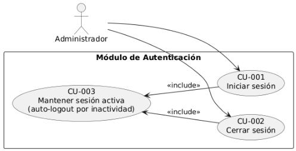

*Figura 1 Casos de uso del módulo de autenticación* 

2. ***Módulo de Usuarios*** 

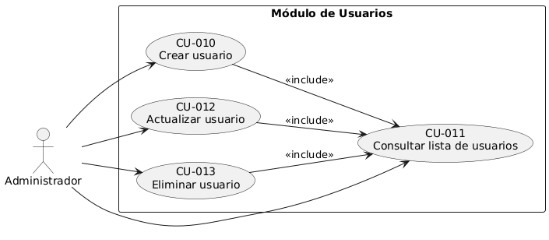

*Figura 2 Casos de uso del módulo de usuarios* 

3. ***Módulo de Roles*** 

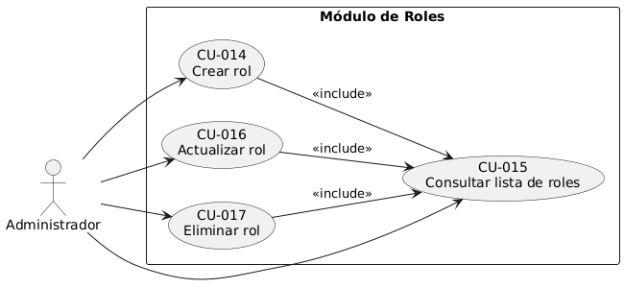

*Figura 3 Casos de uso del módulo de roles* 

4. ***Módulo de Inventario*** 

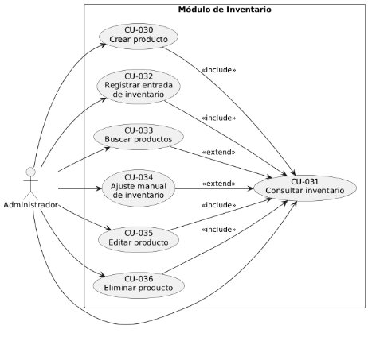

*Figura 4 Casos de uso del módulo de inventario* 

5. ***Módulo de Caja*** 

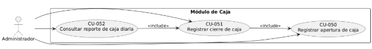

*Figura 5 Casos de uso del módulo de caja* 

6. ***Módulo de Mesas de Billar y Canchas de Tejo*** 

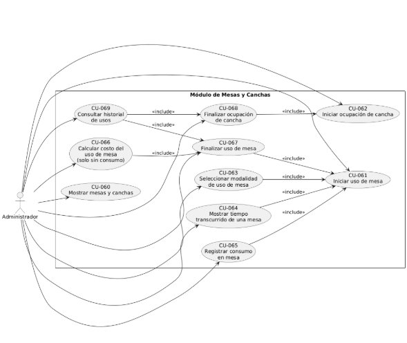

*Figura 6 Casos de uso del módulo de mesas y canchas* 

7. ***Módulo de Ventas*** 

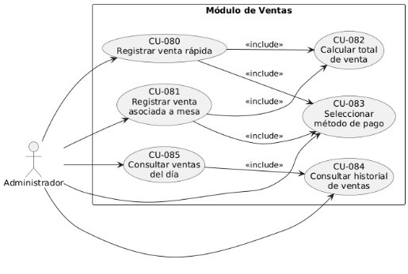

*Figura 7 Casos de uso del módulo de ventas* 

8. ***Módulo de Reportes*** 

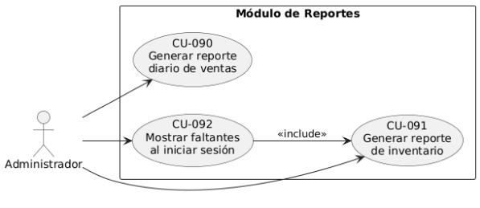

*Figura 8 Casos de uso del módulo de reportes* 

9. ***Módulo de Configuración*** 

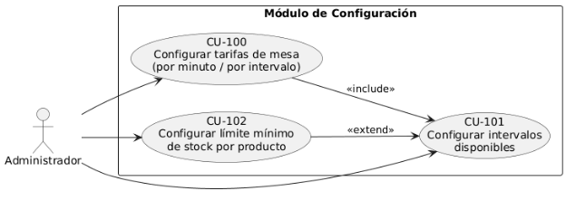

*Figura 9 Casos de uso del módulo de configuración* 

2. **Especificación de Casos de Uso** 
1. ***Módulo de Autenticación*** 

*Tabla 48 Especificación del CU-001 Iniciar sesión* 

|**CU-001** |**Iniciar sesión** |
| - | - |
|Versión  |1\.0  |
|Autores  |Jhoan Sebastián Sierra Perdomo |
|Fuentes  |RF-003 |
|Actores:   |Administrador |

|Objetivos Asociados  |Permitir que el usuario administrador acceda al sistema proporcionando credenciales válidas, habilitando el uso de todas las funciones internas del sistema. ||
| - | :- | :- |
|Casos de uso Asociados  |
CU-002 Cerrar sesión 

CU-003 Mantener sesión activa (auto-logout por inactividad) 
||
|Descripción  |Este caso de uso describe el proceso de autenticación del administrador dentro del sistema. El actor debe ingresar su usuario y contraseña, los cuales son validados por el backend. Al autenticarse correctamente, el sistema inicia una sesión activa vinculada al usuario. ||
|Precondición  |
El usuario debe estar registrado en el sistema. El sistema debe estar operativo. 

Debe existir conexión entre frontend y backend. 
||
|Atributos  |Usuario, contraseña, token de sesión ||
|Secuencia normal  |Paso  |Acción  |
||1  |El administrador ingresa sus credenciales. |
||2 |El sistema valida usuario y contraseña. |
||3 |El sistema crea una sesión activa. |
||4 |El administrador es redirigido al panel principal. |
|Postcondición  |Sesión activa registrada en el sistema. ||

|Excepciones  |Paso  |Acción  |
| - | - | - |
||2 |Si las credenciales no son válidas, se muestra un mensaje de error. |
|Rendimiento  |Paso  |Tiempo máximo  |
||2 |Validación ≤ 2 segundos |
|Importancia  |` `Alta ||
|Urgencia  |Alta ||
|Estado  |En desarrollo ||
|Estabilidad  |Estable ||
|Comentarios  |Requiere encriptación de contraseñas. ||

*Tabla 49 Especificación del CU-002 Cerrar sesión* 

|**CU-002** |**Cerrar sesión** |
| - | - |
|Versión  |1\.0  |
|Autores  |Jhoan Sebastián Sierra Perdomo |
|Fuentes  |RF-004 |
|Actores:   |Administrador |

|Objetivos Asociados  |Permitir finalizar la sesión activa del usuario asegurando que no quede acceso no autorizado al sistema. ||
| - | :- | :- |
|Casos de uso Asociados  |
CU-001 Iniciar sesión 

CU-003 Mantener sesión activa (auto-logout por inactividad) 
||
|Descripción  |El caso de uso describe cómo el administrador cierra su sesión actual, eliminando su token o registro de sesión y volviendo a la pantalla de inicio de sesión. ||
|Precondición  |El usuario debe tener una sesión activa. ||
|Atributos  |Token de sesión ||
|Secuencia normal  |Paso  |Acción  |
||1  |El administrador selecciona la opción “Cerrar sesión”. |
||2  |El sistema invalida el token o sesión activa. |
||3  |El sistema redirige al usuario a la pantalla de inicio de sesión. |
|Postcondición  |Sesión cerrada y no reutilizable. ||
|Excepciones  |Paso  |Acción  |
||2 |Si hay error cerrando la sesión, se crea un cierre forzado.|
|Rendimiento  |Paso  |Tiempo máximo  |
||2 |Cierre ≤ 1 segundo |

|Importancia  |` `Alta |
| - | - |
|Urgencia  |Media |
|Estado  |En desarrollo |
|Estabilidad  |Estable |
|Comentarios  |El cierre debe eliminar cualquier resto de sesión. |

*Tabla 50 Especificación del CU-003 Mantener sesión activa (auto-logout por inactividad)* 

|**CU-003** |**Mantener sesión activa (auto-logout por inactividad)** |
| - | - |
|Versión  |1\.0  |
|Autores  |Jhoan Sebastián Sierra Perdomo |
|Fuentes  |RF-005 |
|Actores:   |Administrador |
|Objetivos Asociados  |Garantizar que la sesión del usuario se mantenga activa mientras interactúa con el sistema y se cierre automáticamente tras un periodo de inactividad. |
|Casos de uso Asociados  |CU-001 Iniciar sesión CU-002 Cerrar sesión |
|Descripción  |Este caso de uso define cómo el sistema supervisa el tiempo de actividad del usuario, renovando su sesión mientras haya |

||interacción y cerrándola si se cumple el tiempo de inactividad establecido. ||
| :- | :- | :- |
|Precondición  |Debe existir una sesión activa. ||
|Atributos  |Tiempo de actividad, timeout ||
|Secuencia normal  |Paso  |Acción  |
||1  |El usuario interactúa normalmente con el sistema. |
||2  |El sistema renueva la sesión mientras haya actividad. |
||3  |El sistema monitorea el tiempo sin interacción. |
|Postcondición  |Si se supera el tiempo límite, la sesión se cierra automáticamente.||
|Excepciones  |Paso  |Acción  |
||3 |Si hay fallos en el monitoreo, se fuerza el cierre por seguridad. |
|Rendimiento  |Paso  |Tiempo máximo  |
||3 |Detección de inactividad ≤ 5 segundos |
|Importancia  |` `Alta ||
|Urgencia  |Media ||
|Estado  |En desarrollo ||
|Estabilidad  |Estable ||

|Comentarios  |Mejora la seguridad del sistema. |
| - | - |

2. ***Módulo de Usuarios*** 

*Tabla 51 Especificación del CU-010 Crear usuario* 

|**CU-010** |**Crear usuario** |
| - | - |
|Versión  |1\.0  |
|Autores  |Jhoan Sebastián Sierra Perdomo |
|Fuentes  |RF-001 |
|Actores:   |Administrador |
|Objetivos Asociados  |Permitir que el administrador registre nuevos usuarios en el sistema asignándoles un rol válido. |
|Casos de uso Asociados  |CU-011 Consultar lista de usuarios CU-014 Crear rol (si el rol no existe) |
|Descripción  |Este caso de uso describe cómo el administrador crea un usuario en el sistema proporcionando datos como nombre, usuario, contraseña y rol asignado. El sistema valida que no exista un usuario duplicado y registra el nuevo usuario. |
|Precondición  |El administrador debe estar autenticado. |

||
Deben existir roles registrados en el sistema. 

El usuario nuevo no debe estar previamente registrado. 
||
| :- | - | :- |
|Atributos  |Nombre, nombre de usuario, contraseña, rol asignado ||
|Secuencia normal  |Paso  |Acción  |
||1  |El administrador ingresa al módulo de usuarios. |
||2 |El administrador selecciona “Crear usuario”. |
||3 |El administrador ingresa los datos solicitados. |
||4 |El sistema valida que el usuario no exista. |
||5 |El sistema registra el nuevo usuario. |
||6 |El sistema confirma la creación exitosa. |
|Postcondición  |Un nuevo usuario queda registrado en el sistema. ||
|Excepciones  |Paso  |Acción  |
||4 |Si el usuario ya existe, el sistema muestra un mensaje de error. |
|Rendimiento  |Paso  |Tiempo máximo  |
||5 |Registro ≤ 2 segundos |
|Importancia  |` `Alta ||

|Urgencia  |Media |
| - | - |
|Estado  |En desarrollo |
|Estabilidad  |Estable |
|Comentarios  |Las contraseñas deben guardarse encriptadas. |

*Tabla 52 Especificación del CU-011 Consultar lista de usuarios* 

|**CU-011** |**Consultar lista de usuarios** |
| - | - |
|Versión  |1\.0 |
|Autores  |Jhoan Sebastián Sierra Perdomo |
|Fuentes  |RF-001 |
|Actores:   |Administrador |
|Objetivos Asociados  |Permitir al administrador visualizar todos los usuarios registrados y su información básica. |
|Casos de uso Asociados  |CU-010 Crear usuarios CU-012 Actualizar usuario CU-013 Eliminar usuario |
|Descripción  |Este caso de uso describe cómo el administrador obtiene la lista completa de usuarios registrados en el sistema con sus roles asociados, permitiendo visualizar información básica. |

|Precondición  |El administrador debe haber iniciado sesión. ||
| - | - | :- |
|Atributos  |ID, nombre, usuario, rol, estado ||
|Secuencia normal  |Paso  |Acción  |
||1  |El administrador accede a la sección de usuarios. |
||2 |El sistema muestra la lista completa de usuarios registrados. |
|Postcondición  |Listado actualizado disponible en pantalla. ||
|Excepciones  |Paso  |Acción  |
||||
|Rendimiento  |Paso  |Tiempo máximo  |
||2 |Consulta ≤ 2 segundos |
|Importancia  |Alta ||
|Urgencia  |Alta ||
|Estado  |En desarrollo ||
|Estabilidad  |Estable ||
|Comentarios  |Se recomienda paginación para grandes volúmenes de usuarios. ||

*Tabla 53 Especificación del CU-012 Actualizar usuario* 

|**CU-012** |**Actualizar usuario** ||
| - | - | :- |
|Versión  |1\.0 ||
|Autores  |Jhoan Sebastián Sierra Perdomo ||
|Fuentes  |RF-001 ||
|Actores:   |Administrador ||
|Objetivos Asociados  |Permitir modificar la información de un usuario existente, como sus datos básicos o su rol. ||
|Casos de uso Asociados  |CU-011 Consultar lista de usuarios ||
|Descripción  |El administrador selecciona un usuario existente y actualiza su información. El sistema valida los cambios y registra las modificaciones. ||
|Precondición  |El administrador debe estar autenticado. El usuario objetivo debe existir. ||
|Atributos  |Nombre, contraseña (opcional), rol ||
|Secuencia normal |Paso  |Secuencia normal  |
||1  |El administrador consulta la lista de usuarios. |
||2  |El administrador selecciona un usuario para modificar. |
||3  |El administrador edita la información del usuario. |

||4 |El sistema valida y actualiza los datos. |
| :- | - | - |
||5 |El sistema confirma la actualización. |
|Postcondición  |Los datos modificados quedan guardados. ||
|Excepciones  |Paso  |Excepciones  |
||4 |Si hay error en la validación, se cancela la transacción. |
|Rendimiento  |Paso  |Rendimiento  |
||4 |Actualización ≤ 2 segundos |
|Importancia  |Alta ||
|Urgencia  |Media ||
|Estado  |En desarrollo ||
|Estabilidad  |Estable ||
|Comentarios  |Debe registrarse en auditoría (RF-033). ||

*Tabla 54 Especificación del CU-013 Eliminar usuario* 

|**CU-013** |**Eliminar usuario** |
| - | - |
|Versión  |1\.0 |
|Autores  |Jhoan Sebastián Sierra Perdomo |

|Fuentes  |RF-001 ||
| - | - | :- |
|Actores:   |Administrador ||
|Objetivos Asociados  |Permitir eliminar un usuario existente del sistema si ya no requiere acceso. ||
|Casos de uso Asociados |` `CU-011 Consultar lista de usuarios ||
|Descripción  |El administrador selecciona un usuario existente y solicita su eliminación. El sistema valida que no sea el único administrador y procede a eliminarlo. ||
|Precondición  |El administrador debe estar autenticado. El usuario objetivo debe existir. ||
|Atributos  |ID de usuario ||
|Secuencia normal  |Paso  |Secuencia normal  |
||1  |El administrador consulta la lista de usuarios. |
||2  |El administrador selecciona un usuario para eliminar. |
||3  |El sistema solicita confirmación. |
||4 |El administrador confirma la eliminación. |
||5 |El sistema elimina el usuario. |
|Postcondición  |El usuario queda eliminado del sistema. ||

|Excepciones  |Paso |Acción |
| - | - | - |
||5 |Si el usuario es el único administrador, se rechaza la eliminación. |
|Rendimiento  |Paso |Tiempo máximo  |
||5 |Eliminación ≤ 2 segundos |
|Importancia  |Media ||
|Urgencia  |Media ||
|Estado  |En desarrollo ||
|Estabilidad  |Estable ||
|Comentarios |Toda eliminación debe registrarse en auditoría (RF-033). ||

3. ***Módulo de Roles*** 

*Tabla 55 Especificación del CU-014 Crear rol* 

|**CU-014** |**Crear rol** |
| - | - |
|Versión  |1\.0 |
|Autores  |Jhoan Sebastián Sierra Perdomo |
|Fuentes  |RF-002 |
|Actores:   |Administrador |

|Objetivos Asociados  |Registrar un nuevo rol que determine los permisos de los usuarios dentro del sistema. ||
| - | :- | :- |
|Casos de uso Asociados  |
CU-015 Consultar lista de roles CU-010 Crear usuario 

CU-012 Actualizar usuario 
||
|Descripción  |El administrador crea un nuevo rol proporcionando un nombre y, si aplica, una breve descripción. El sistema valida que el rol no exista y lo registra para ser asignado a usuarios. ||
|Precondición  |El administrador debe estar autenticado. El rol a crear no debe existir previamente. ||
|Atributos  |Nombre del rol, descripción del rol ||
|Secuencia normal  |Paso  |Acción  |
||1  |El administrador navega a la sección de roles. |
||2 |El administrador selecciona “Crear rol”. |
||3 |El administrador ingresa el nombre (y descripción opcional). |
||4  |El sistema valida que no exista un rol con ese nombre. |
||5 |El sistema registra el nuevo rol. |
||6 |El sistema muestra un mensaje de confirmación. |

|Postcondición  |Un nuevo rol queda registrado y disponible para asignación. ||
| - | - | :- |
|Excepciones  |Paso  |Acción  |
||4 |Si el rol existe, se muestra un mensaje de error. |
|Rendimiento  |Paso  |Tiempo máximo  |
||5 |Registro del rol en el sistema ≤ 2 segundos |
|Importancia  |Media ||
|Urgencia  |Baja ||
|Estado  |En desarrollo ||
|Estabilidad  |Estable ||
|Comentarios  |Roles incorrectos pueden comprometer permisos del sistema. ||

*Tabla 56 Especificación del CU-015 Consultar lista de roles* 

|**CU-015** |**Consultar lista de roles** |
| - | - |
|Versión  |1\.0 |
|Autores  |Jhoan Sebastián Sierra Perdomo |
|Fuentes  |RF-002 |
|Actores:   |Administrador |

|Objetivos Asociados  |Permitir visualizar todos los roles existentes para administrarlos o asignarlos a usuarios. ||
| - | :- | :- |
|Casos de uso Asociados  |
CU-014 Crear rol 

CU-016 Actualizar rol CU-017 Eliminar rol CU-010 Crear usuario CU-012 Actualizar usuario 
||
|Descripción  |El sistema lista todos los roles registrados, mostrando su nombre y descripción. ||
|Precondición  |El administrador debe estar autenticado. ||
|Atributos  |ID de rol, nombre de rol, descripción. ||
|Secuencia normal  |Paso  |Acción  |
||1  |El administrador accede a la sección de roles. |
||2  |El sistema muestra la lista de roles registrados. |
|Postcondición  |Los roles quedan visibles para consulta. ||
|Excepciones  |Paso  |Acción  |
||||
|Rendimiento  |Paso  |Tiempo máximo  |

||2 |Consulta ≤ 2 segundos |
| :- | - | - |
|Importancia  |Alta ||
|Urgencia  |Alta ||
|Estado  |En desarrollo ||
|Estabilidad  |Estable ||
|Comentarios  |Se recomienda paginación para listas extensas. ||

*Tabla 57 Especificación del CU-016 Actualizar rol* 

|**CU-016** |**Actualizar rol** |
| - | - |
|Versión  |1\.0 |
|Autores  |Jhoan Sebastián Sierra Perdomo |
|Fuentes  |RF-002 |
|Actores:   |Administrador |
|Objetivos Asociados  |Modificar la información de un rol existente, como su nombre o descripción. |
|Casos de uso Asociados  |CU-015 Consultar lista de roles |

|Descripción  |El administrador selecciona un rol existente y edita sus atributos. El sistema evalúa los cambios, evita duplicados y actualiza la información. ||
| - | :- | :- |
|Precondición  |El administrador debe estar autenticado. El rol objetivo debe existir. ||
|Atributos  |Nombre, descripción ||
|Secuencia normal  |Paso  |Acción  |
||1  |El administrador consulta la lista de roles. |
||2  |El administrador selecciona un rol. |
||3  |El administrador edita los datos del rol. |
||4 |El sistema valida y actualiza la información. |
||5 |El sistema muestra un mensaje de confirmación. |
|Postcondición  |El rol queda actualizado en el sistema. ||
|Excepciones  |Paso  |Acción  |
||4 |Si el nuevo nombre ya existe, se cancela la actualización. |
|Rendimiento  |Paso  |Tiempo máximo  |
||4 |Actualización ≤ 2 segundos |

|Importancia  |Media |
| - | - |
|Urgencia  |Media |
|Estado  |En desarrollo |
|Estabilidad  |Estable |
|Comentarios  |Debe registrarse en auditoría (RF-033). |

*Tabla 58 Especificación del CU-017 Eliminar rol* 

|**CU-017** |**Eliminar rol** |
| - | - |
|Versión  |1\.0 |
|Autores  |Jhoan Sebastián Sierra Perdomo |
|Fuentes  |RF-002 |
|Actores:   |Administrador |
|Objetivos Asociados  |Eliminar un rol que ya no se utilice en el sistema. |
|Casos de uso Asociados  |CU-015 Consultar lista de roles |
|Descripción  |El administrador selecciona un rol existente y solicita su eliminación. El sistema valida que el rol no esté asignado a ningún usuario antes de proceder. |
|Precondición  |El administrador debe estar autenticado. |

||
El rol objetivo debe existir. 

El rol no debe estar asignado a ningún usuario activo. 
||
| :- | - | :- |
|Atributos  |ID del rol. ||
|Secuencia normal  |Paso  |Acción  |
||1  |El administrador consulta la lista de roles. |
||2 |El administrador selecciona un rol. |
||3 |El sistema solicita confirmación. |
||4 |El administrador confirma la eliminación. |
||5 |El sistema elimina el rol. |
|Postcondición  |El rol queda eliminado del sistema. ||
|Excepciones  |Paso  |Acción  |
||5 |Si el rol está asignado a usuarios, se rechaza la eliminación. |
|Rendimiento  |Paso  |Tiempo máximo  |
||5 |Eliminación del rol ≤ 2 segundos |
|Importancia  |Media ||
|Urgencia  |Baja ||

|Estado  |En desarrollo |
| - | - |
|Estabilidad  |Estable |
|Comentarios  |Toda eliminación debe registrarse en auditoría (RF-033). |

4. ***Módulo de Inventario*** 

*Tabla 59 Especificación del CU-030 Crear producto* 

|**CU-030** |**Crear producto** |
| - | - |
|Versión  |1\.0 |
|Autores  |Jhoan Sebastián Sierra Perdomo |
|Fuentes  |RF-017 |
|Actores:   |Administrador |
|Objetivos Asociados  |Registrar un nuevo producto en el inventario del negocio. |
|Casos de uso Asociados  |CU-031 Consultar inventario |
|Descripción  |El administrador registra un nuevo producto proporcionando nombre, categoría, precio y cantidad inicial. El sistema valida que no exista un producto con el mismo nombre. |
|Precondición  |El administrador debe estar autenticado. |

||El producto no debe existir previamente. ||
| :- | - | :- |
|Atributos  |Nombre del producto, categoría, subcategoría, precio de costo, precio de venta, stock inicial, stock mínimo, estado de producto, usuario responsable ||
|Secuencia normal  |Paso  |Acción  |
||1  |El administrador accede al módulo de inventario. |
||2  |Selecciona “Crear producto”. |
||3  |Ingresa los datos requeridos. |
||4 |El sistema valida duplicados. |
||5 |El sistema registra el producto. |
||6 |Muestra confirmación. |
|Postcondición  |El producto queda registrado en el inventario. ||
|Excepciones  |Paso  |Acción  |
||4 |Si ya existe un producto con ese nombre, se muestra error. |
|Rendimiento  |Paso  |Tiempo máximo  |
||5 |Registrar el producto ≤ 2 s |
|Importancia  |Alta ||

|Urgencia  |Alta |
| - | - |
|Estado  |En desarrollo |
|Estabilidad  |Estable |
|Comentarios  |Debe quedar registrado en auditoría. |

*Tabla 60 Especificación del CU-031 Consultar inventario* 

|**CU-031** |**Consultar inventario** |
| - | - |
|Versión  |1\.0 |
|Autores  |Jhoan Sebastián Sierra Perdomo |
|Fuentes  |RF-019 |
|Actores:   |Administrador |
|Objetivos Asociados  |Visualizar todos los productos del inventario con sus cantidades actuales. |
|Casos de uso Asociados  |
CU-030 Crear producto 

CU-032 Registrar entrada de inventario CU-034 Ajuste de inventario 

CU-035 Editar producto 

CU-036 Eliminar producto 
|

|Descripción  |El sistema muestra la lista completa de productos en inventario, con sus cantidades, categorías y precios. ||
| - | :- | :- |
|Precondición  |El administrador debe estar autenticado. ||
|Atributos  |ID del producto, nombre del producto, categoría, subcategoría, stock actual, stock mínimo, estado del producto. ||
|Secuencia normal  |Paso  |Acción  |
||1  |El administrador abre la sección de inventario. |
||2  |El sistema muestra la lista de productos. |
|Postcondición  |El administrador visualiza el inventario actualizado. ||
|Excepciones  |Paso  |Acción  |
||||
|Rendimiento  |Paso  |Tiempo máximo  |
||2 |Consulta ≤ 2.5 segundos |
|Importancia  |Alta ||
|Urgencia  |Alta ||
|Estado  |En desarrollo ||
|Estabilidad  |Estable ||
|Comentarios  |Debe incluir indicadores visuales de bajo stock. ||

*Tabla 61 Especificación del CU-032 Registrar entrada de inventario* 

|**CU-032** |**Registrar entrada de inventario** ||
| - | - | :- |
|Versión  |1\.0 ||
|Autores  |Jhoan Sebastián Sierra Perdomo ||
|Fuentes  |RF-018 ||
|Actores:   |Administrador ||
|Objetivos Asociados  |Permitir registrar nuevas existencias cuando llega mercancía al negocio. ||
|Casos de uso Asociados  |CU-031 Consultar inventario ||
|Descripción  |El administrador selecciona un producto y registra la cantidad ingresada, aumentando el stock total. ||
|Precondición  |El administrador debe estar autenticado. El producto debe existir. ||
|Atributos  |Cantidad agregada, fecha de registro, ID de producto. ||
|Secuencia normal  |Paso  |Acción  |
||1  |El administrador selecciona un producto. |
||2  |Selecciona “Registrar entrada”. |
||3  |Ingresa la cantidad recibida. |

||4 |El sistema actualiza el inventario. |
| :- | - | - |
||5 |El sistema confirma la operación. |
|Postcondición  |El inventario queda actualizado con la nueva entrada. ||
|Excepciones  |Paso  |Acción  |
||3 |Si la cantidad es inválida (≤0), muestra error. |
|Rendimiento  |Paso  |Tiempo máximo  |
||4 |Actualización ≤ 2 segundo |
|Importancia  |Alta ||
|Urgencia  |Alta ||
|Estado  |En desarrollo ||
|Estabilidad  |Estable ||
|Comentarios  |Debe quedar registrado en auditoría (RF-033). ||

*Tabla 62 Especificación del CU-033 Buscar productos* 

|**CU-033** |**Buscar productos** |
| - | - |
|Versión  |1\.0 |
|Autores  |Jhoan Sebastián Sierra Perdomo |

|Fuentes  |RF-021 ||
| - | - | :- |
|Actores:   |Administrador ||
|Objetivos Asociados  |Localizar rápidamente productos por nombre o categoría. ||
|Casos de uso Asociados  |CU-031 Consultar inventario ||
|Descripción  |El administrador ingresa un texto de búsqueda y el sistema filtra los productos que coinciden. ||
|Precondición  |El administrador debe estar autenticado. ||
|Atributos  |Texto de búsqueda, categoría, subcategoría, resultado de búsqueda. ||
|Secuencia normal  |Paso  |Acción  |
||1  |El administrador ingresa texto o selecciona filtros. |
||2  |El sistema analiza el criterio de búsqueda. |
||3  |El sistema consulta la base de datos. |
||4 |El sistema muestra los resultados coincidentes. |
|Postcondición  |Se muestra la lista de productos filtrados. ||
|Excepciones  |Paso  |Acción  |
||4 |Si no hay coincidencias, el sistema muestra “No se encontraron productos con ese criterio”. |

|Rendimiento  |Paso  |Tiempo máximo  |
| - | - | - |
||4 |Mostrar resultados ≤ 1 segundo |
|Importancia  |Media ||
|Urgencia  |Media ||
|Estado  |En desarrollo ||
|Estabilidad  |Estable ||
|Comentarios  |Debe permitir búsqueda en tiempo real (autocompletado) si es posible. Debe ignorar mayúsculas/minúsculas. ||

*Tabla 63 Especificación del CU-034 Ajuste manual de inventario* 

|**CU-034** |**Ajuste manual de inventario** |
| - | - |
|Versión  |1\.0 |
|Autores  |Jhoan Sebastián Sierra Perdomo |
|Fuentes  |RF-034 |
|Actores:   |Administrador |
|Objetivos Asociados  |Permitir ajustar manualmente el stock de un producto por razones operativas (mermas, daño, ajuste administrativo, corrección de inventario). |

|Casos de uso Asociados  |CU-031 Consultar inventario ||
| - | - | :- |
|Descripción  |El administrador modifica manualmente la cantidad de un producto registrando un motivo del ajuste. ||
|Precondición  |
El producto debe existir. 

El administrador debe tener sesión activa. 
||
|Atributos  |ID del producto, stock actual, cantidad de ajuste, motivo de ajuste, usuario responsable, fecha de ajuste. ||
|Secuencia normal  |Paso  |Acción  |
||1  |El administrador selecciona un producto. |
||2  |Selecciona “Ajustar inventario”. |
||3  |Ingresa nueva cantidad y motivo. |
||4 |El sistema actualiza el inventario. |
||5 |Confirma la operación. |
|Postcondición  |Nueva cantidad registrada en el inventario. ||
|Excepciones  |Paso  |Acción  |
||3 |Si la cantidad es inválida, muestra error. |
|Rendimiento  |Paso  |Tiempo máximo  |
||4 |Actualización ≤ 1 segundo |

|Importancia  |Alta |
| - | - |
|Urgencia  |Media |
|Estado  |En desarrollo |
|Estabilidad  |Estable |
|Comentarios  |Debe quedar en auditoría (RF-033). |

*Tabla 64 Especificación del CU-035 Editar producto* 

|**CU-035** |**Editar producto** |
| - | - |
|Versión  |1\.0 |
|Autores  |Jhoan Sebastián Sierra Perdomo |
|Fuentes  |RF-017 |
|Actores:   |Administrador |
|Objetivos Asociados  |Actualizar atributos de un producto existente. |
|Casos de uso Asociados  |CU-031 Consultar inventario |
|Descripción  |El administrador edita datos de un producto, como nombre, categoría o precio. El sistema valida duplicados. |
|Precondición  |
El producto debe existir. 

El administrador debe estar autenticado. 
|

|Atributos  |Id del producto, campos modificados, usuario responsable, fecha de modificación. ||
| - | :- | :- |
|Secuencia normal  |Paso  |Acción  |
||1  |El administrador consulta inventario. |
||2  |Selecciona un producto. |
||3  |Edita los datos. |
||4 |El sistema valida y actualiza. |
||5 |Muestra confirmación. |
|Postcondición  |El producto queda actualizado correctamente. ||
|Excepciones  |Paso  |Acción  |
||4 |Si el nombre ya existe, muestra error. |
|Rendimiento  |Paso  |Tiempo máximo  |
||4 |Actualización ≤ 2 segundos. |
|Importancia  |Media ||
|Urgencia  |Media ||
|Estado  |En desarrollo ||
|Estabilidad  |Estable ||

|Comentarios  |Debe registrarse en auditoría. |
| - | - |

*Tabla 65 Especificación del CU-036 Eliminar producto* 

|**CU-036** |**Eliminar producto** ||
| - | - | :- |
|Versión  |1\.0 ||
|Autores  |Jhoan Sebastián Sierra Perdomo ||
|Fuentes  |RF-017 ||
|Actores:   |Administrador ||
|Objetivos Asociados  |Eliminar productos que ya no se vendan o estén obsoletos. ||
|Casos de uso Asociados  |CU-031 Consultar inventario ||
|Descripción  |El administrador elimina un producto existente. El sistema verifica que no esté asociado a ventas recientes. ||
|Precondición  |
El producto debe existir. 

El administrador debe estar autenticado. 
||
|Atributos  |Id del producto, estado del producto, usuario responsable, fecha de eliminación. ||
|Secuencia normal  |Paso  |Acción  |
||1  |El administrador consulta inventario. |

||2  |Selecciona un producto. |
| :- | - | - |
||3  |Selecciona un producto. |
||4 |El administrador confirma. |
||5 |El sistema elimina el producto. |
|Postcondición  |El producto queda eliminado del sistema. ||
|Excepciones  |Paso  |Acción  |
||5 |Si el producto está asociado a ventas, se rechaza la eliminación. |
|Rendimiento  |Paso  |Tiempo máximo  |
||5 |` `Eliminación ≤ 2 segundos |
|Importancia  |Media ||
|Urgencia  |Baja ||
|Estado  |En desarrollo ||
|Estabilidad  |Estable ||
|Comentarios  |Debe registrarse en auditoría. ||

5. ***Módulo de Caja*** 

*Tabla 66 Especificación del CU-050 Registrar apertura de caja* 

|**CU-050** |**Registrar apertura de caja** ||
| - | - | :- |
|Versión  |1\.0 ||
|Autores  |Jhoan Sebastián Sierra Perdomo ||
|Fuentes  |RF-035 ||
|Actores:   |Administrador ||
|Objetivos Asociados  |Registrar el inicio de la jornada indicando el efectivo inicial disponible en la caja antes de iniciar operaciones. ||
|Casos de uso Asociados  |CU-051 Registrar cierre de caja ||
|Descripción  |El administrador registra la apertura de caja proporcionando un monto inicial. El sistema marca la caja como “abierta” y habilita el registro de ventas. ||
|Precondición  |
El administrador debe estar autenticado. 

No debe existir una caja abierta actualmente. 
||
|Atributos  |Monto inicial, fecha/hora de apertura, ID del usuario que abre la caja. ||
|Secuencia normal  |Paso  |Acción  |
||1  |El administrador accede al módulo de caja. |
||2  |Selecciona “Apertura de caja”. |

||3  |Ingresa el monto inicial. |
| :- | - | - |
||4 |El sistema valida la información. |
||5 |El sistema registra la apertura. |
||6 |Se confirma la apertura de caja. |
|Postcondición  |Caja marcada como abierta y lista para operar. ||
|Excepciones  |Paso  |Acción  |
||3 |Si ya hay una caja abierta, el sistema rechaza la operación. |
|Rendimiento  |Paso  |Tiempo máximo  |
||5 |Registro ≤ 1 segundo |
|Importancia  |Alta ||
|Urgencia  |Alta ||
|Estado  |En desarrollo ||
|Estabilidad  |Estable ||
|Comentarios  |Una apertura por día; no debe duplicarse. ||

*Tabla 67 Especificación del CU-051 Registrar cierre de caja* 

|**CU-051** |**Registrar cierre de caja** |
| - | - |

|Versión  |1\.0 ||
| - | - | :- |
|Autores  |Jhoan Sebastián Sierra Perdomo ||
|Fuentes  |RF-036 ||
|Actores:   |Administrador ||
|Objetivos Asociados  |Registrar el cierre de operaciones del día, calculando ventas totales, ingresos por método de pago y efectivo final esperado. ||
|Casos de uso Asociados  |CU-050 Registrar apertura de caja CU-052 Consultar reporte de caja diaria ||
|Descripción  |El administrador cierra la caja, registrando el monto final de efectivo y permitiendo que el sistema calcule diferencias y el total de ventas del día. ||
|Precondición  |
Debe existir una caja abierta. 

El administrador debe estar autenticado. 
||
|Atributos  |Monto final, diferencias, fecha/hora de cierre, total de ventas. ||
|Secuencia normal  |Paso  |Acción  |
||1  |El administrador accede al módulo de caja. |
||2  |Selecciona “Cerrar caja”. |
||3  |Ingresa el monto final contado diferenciando los montos de cada métodos de pago. |

||4 |El sistema calcula ventas del día y diferencias. |
| :- | - | - |
||5 |El sistema registra el cierre. |
||6 |Se confirma el cierre. |
|Postcondición  |Caja marcada como cerrada y datos del día almacenados. ||
|Excepciones  |Paso  |Acción  |
||1 |Si no hay caja abierta, se rechaza la operación. |
|Rendimiento  |Paso  |Tiempo máximo  |
||4 |Cálculo ≤ 2 segundos |
|Importancia  |Alta ||
|Urgencia  |Alta ||
|Estado  |En desarrollo ||
|Estabilidad  |Estable ||
|Comentarios  |El reporte de caja depende totalmente del cierre. ||

*Tabla 68 Especificación del CU-052 Consultar reporte de caja diaria* 

|**CU-052** |**Consultar reporte de caja diaria** |
| - | - |
|Versión  |1\.0 |

|Autores  |Jhoan Sebastián Sierra Perdomo ||
| - | - | :- |
|Fuentes  |RF-037 ||
|Actores:   |Administrador ||
|Objetivos Asociados  |Visualizar el resumen completo de la caja del día incluyendo ventas, totales por método de pago y efectivo final. ||
|Casos de uso Asociados  |CU-051 Registrar cierre de caja ||
|Descripción  |El administrador consulta el reporte generado automáticamente después del cierre de caja. Se listan: ventas totales del día, ingresos por cada método de pago, efectivo inicial, efectivo final y diferencias. ||
|Precondición  |Debe existir un cierre de caja registrado. El administrador debe estar autenticado. ||
|Atributos  |Total ventas, total efectivo, total Nequi, monto inicial, monto final, diferencias. ||
|Secuencia normal  |Paso  |Acción  |
||1  |El administrador accede al módulo de caja. |
||2  |Selecciona “Reporte de caja diaria”. |
||3  |El sistema muestra el reporte del día. |
|Postcondición  |Reporte disponible y consultado. ||

|Excepciones  |Paso  |Acción  |
| - | - | - |
||2 |Si no se ha cerrado la caja, se notifica que el reporte no está disponible. |
|Rendimiento  |Paso  |Tiempo máximo  |
||3 |Generación ≤ 2 segundos |
|Importancia  |Alta ||
|Urgencia  |Media ||
|Estado  |En desarrollo ||
|Estabilidad  |Estable ||
|Comentarios  |Este reporte puede servir como base para cierres contables. ||

6. ***Módulo de Mesas de Billar y Canchas de Tejo*** 

*Tabla 69 Especificación del CU-060 Mostrar mesas y canchas* 

|**CU-060** |**Mostrar mesas y canchas** |
| - | - |

|Versión  |1\.0 ||
| - | - | :- |
|Autores  |Jhoan Sebastián Sierra Perdomo ||
|Fuentes  |RF-006, RF-015 ||
|Actores:   |Administrador ||
|Objetivos Asociados  |Permitir visualizar todas las mesas de billar y canchas de tejo con su estado actual. ||
|Casos de uso Asociados  |
CU-061 Iniciar uso de mesa 

CU-062 Iniciar ocupación de cancha CU-067 Finalizar uso de mesa CU-068 Finalizar ocupación de cancha 
||
|Descripción  |El sistema muestra un tablero general con todas las mesas y canchas indicando si están disponibles u ocupadas, junto con indicadores de uso activo. ||
|Precondición  |El administrador debe estar autenticado. ||
|Atributos  |ID, tipo (mesa/cancha), estado, hora de inicio, modalidad (si aplica). ||
|Secuencia normal  |Paso  |Acción  |
||1  |El administrador ingresa al módulo de mesas y canchas. |
||2 |El sistema lista todas las mesas y canchas con su estado. |

|Postcondición  |Se visualiza el estado actualizado de cada elemento. ||
| - | - | :- |
|Excepciones  |Paso  |Acción  |
||||
|Rendimiento  |Paso  |Tiempo máximo  |
||2 |≤ 1 segundo |
|Importancia  |Alta ||
|Urgencia  |Alta ||
|Estado  |En desarrollo ||
|Estabilidad  |Estable ||
|Comentarios  |Actualización debe ser dinámica (intervalos cortos). ||

*Tabla 70 Especificación del CU-061 Iniciar uso de mesa* 

|**CU-061** |**Iniciar uso de mesa** |
| - | - |
|Versión  |1\.0 |
|Autores  |Jhoan Sebastián Sierra Perdomo |

|Fuentes  |RF-007 ||
| - | - | :- |
|Actores:   |Administrador ||
|Objetivos Asociados  |Registrar el inicio del uso de una mesa de billar. ||
|Casos de uso Asociados  |
CU-063 **Seleccionar modalidad de uso de mesa** CU-064 Mostrar tiempo 

CU-065 Registrar consumo 

CU-067 Finalizar uso 
||
|Descripción  |El administrador marca una mesa como “en uso”, registrando la hora de inicio y habilitando la selección de modalidad. ||
|Precondición  |La mesa debe estar disponible. ||
|Atributos  |ID mesa, hora inicio, modalidad. ||
|Secuencia normal  |Paso  |Acción  |
||1  |El administrador selecciona una mesa disponible. |
||2  |El sistema solicita la modalidad del uso. |
||3  |El sistema registra el inicio del uso. |
|Postcondición  |Mesa marcada como ocupada. ||
|Excepciones  |Paso  |Acción  |
||1 |Si está ocupada, se rechaza el inicio. |

|Rendimiento  |Paso  |Tiempo máximo  |
| - | - | - |
||3 |Registrar inicio ≤ 1 segundo |
|Importancia  |Alta ||
|Urgencia  |Alta ||
|Estado  |En desarrollo ||
|Estabilidad  |Estable ||
|Comentarios  |||
*Tabla 71 Especificación del CU-062 Iniciar ocupación de cancha* 

|**CU-062** |**Iniciar ocupación de cancha** |
| - | - |
|Versión  |1\.0 |
|Autores  |Jhoan Sebastián Sierra Perdomo |
|Fuentes  |RF-008 |
|Actores:   |Administrador |
|Objetivos Asociados  |Registrar que una cancha de tejo está ocupada. |
|Casos de uso Asociados  |CU-068 Finalizar ocupación CU-069 Consultar historial de usos |

|Descripción  |El administrador marca una cancha como ocupada. No hay temporizador ni cálculo de tiempo. ||
| - | :- | :- |
|Precondición  |La cancha debe estar disponible. ||
|Atributos  |ID cancha, hora de ingreso opcional. ||
|Secuencia normal  |Paso  |Acción  |
||1  |Seleccionar una cancha disponible. |
||2  |El sistema la marca como ocupada. |
|Postcondición  |Cancha ocupada. ||
|Excepciones  |Paso  |Acción  |
||2 |Ocupada → rechazar inicio. |
|Rendimiento  |Paso  |Tiempo máximo  |
||2 |≤ 1 segundo |
|Importancia  |Alta ||
|Urgencia  |Alta ||
|Estado  |En desarrollo ||
|Estabilidad  |Estable ||
|Comentarios  |||
*Tabla 72 Especificación del CU-063 Seleccionar modalidad de uso de mesa* 

|**CU-063** |**Seleccionar modalidad de uso de mesa** ||
| - | - | :- |
|Versión  |1\.0 ||
|Autores  |Jhoan Sebastián Sierra Perdomo ||
|Fuentes  |RF-009 ||
|Actores:   |Administrador ||
|Objetivos Asociados  |Configurar si la mesa se usará por **intervalo** (30/60 min) o tiempo libre. ||
|Casos de uso Asociados  |CU-061 Iniciar uso de mesa ||
|Descripción  |El sistema permite seleccionar la modalidad antes de registrar el uso de la mesa. ||
|Precondición  |La mesa debe estar iniciando un uso. ||
|Atributos  |Modalidad, duración (si es intervalo). ||
|Secuencia normal  |Paso  |Acción  |
||1  |El sistema solicita modalidad. |
||2  |El administrador selecciona modalidad. |
||3  |Si selecciona intervalo, elige duración. |
||4 |El sistema confirma selección. |

|Postcondición  |La modalidad queda seleccionada ||
| - | - | :- |
|Excepciones  |Paso  |Acción  |
||||
|Rendimiento  |Paso  |Tiempo máximo  |
||||
|Importancia  |Alta ||
|Urgencia  |Alta ||
|Estado  |En desarrollo ||
|Estabilidad  |Estable ||
|Comentarios  |||
*Tabla 73 Especificación del CU-064 Mostrar tiempo transcurrido* *de una mesa* 

|**CU-064** |**Mostrar tiempo transcurrido** **de una mesa** |
| - | - |
|Versión  |1\.0 |
|Autores  |Jhoan Sebastián Sierra Perdomo |
|Fuentes  |RF-010 |
|Actores:   |Administrador |

|Objetivos Asociados  |Mostrar en tiempo real el tiempo transcurrido desde el inicio del uso de una mesa de billar. ||
| - | :- | :- |
|Casos de uso Asociados  |CU-061 Iniciar uso CU-067 Finalizar uso ||
|Descripción  |El sistema calcula continuamente el tiempo transcurrido desde que la mesa fue activada en modalidad de tiempo libre o intervalo, mostrando un temporizador que se actualiza en pantalla. ||
|Precondición  |
La mesa debe estar en uso. 

Debe existir un registro de hora de inicio. 
||
|Atributos  |Hora de inicio, tiempo transcurrido, modalidad. ||
|Secuencia normal  |Paso  |Acción  |
||1  |El sistema obtiene la hora de inicio de la mesa. |
||2  |Calcula el tiempo transcurrido. |
||3  |Muestra el temporizador actualizado en pantalla. |
|Postcondición  |El tiempo es visible y se mantiene actualizado mientras la mesa esté activa. ||
|Excepciones  |Paso  |Acción  |
||||

|Rendimiento  |Paso  |Tiempo máximo  |
| - | - | - |
||3 |Actualización del temporizador ≤ 1 segundo |
|Importancia  |Alta ||
|Urgencia  |Alta ||
|Estado  |En desarrollo ||
|Estabilidad  |Estable ||
|Comentarios  |El temporizador debe seguir funcionando incluso si el frontal se recarga. ||

*Tabla 74 Especificación del CU-065 Registrar consumo en mesa* 

|**CU-065** |**Registrar consumo en mesa** |
| - | - |
|Versión  |1\.0 |
|Autores  |Jhoan Sebastián Sierra Perdomo |
|Fuentes  |RF-012 |
|Actores:   |Administrador |

|Objetivos Asociados  |Registrar productos consumidos mientras se usa una mesa y anular automáticamente el cobro por tiempo. ||
| - | :- | :- |
|Casos de uso Asociados  |CU-061 Iniciar uso de mesa CU-067 Finalizar uso de mesa ||
|Descripción  |El administrador selecciona una mesa activa y añade productos consumidos por los clientes. La existencia varios consumos registrado anula automáticamente el cobro de tiempo. Si posteriormente se eliminan los consumos, el sistema restablece el estado de la mesa como “sin consumo” para efectos del cálculo del costo. ||
|Precondición  |
La mesa debe estar en uso. 

El producto debe existir en inventario. 
||
|Atributos  |Lista de productos, cantidades, costo total, ID de mesa. ||
|Secuencia normal  |Paso  |Acción  |
||1  |El administrador selecciona una mesa en uso. |
||2  |Selecciona productos desde el inventario. |
||3  |Ingresa cantidades consumidas. |
||4 |El sistema registra los consumos. |
||5 |El sistema marca el tiempo como gratuito (costo = 0). |
|Postcondición  |Consumo registrado y asociado a la mesa. ||

|Excepciones  |Paso  |Acción  |
| - | - | - |
||2 |Si el producto no existe, muestra error. |
||3 |Si la cantidad excede stock, muestra advertencia. |
|Rendimiento  |Paso  |Tiempo máximo  |
||4 |Registro ≤ 2 segundos |
|Importancia  |Alta ||
|Urgencia  |Alta ||
|Estado  |En desarrollo ||
|Estabilidad  |Estable ||
|Comentarios  |Se debe descontar inventario automáticamente (RF-020). ||

*Tabla 75 Especificación del CU-066 Calcular costo del uso de mesa (solo sin consumo)* 

|**CU-066** |**Calcular costo del uso de mesa (solo sin consumo)** |
| - | - |
|Versión  |1\.0 |
|Autores  |Jhoan Sebastián Sierra Perdomo |
|Fuentes  |RF-011 |

|Actores:   |Administrador ||
| - | - | :- |
|Objetivos Asociados  |Calcular el costo del uso de una mesa de billar únicamente cuando no se registran consumos. ||
|Casos de uso Asociados  |CU-067 Finalizar uso de mesa ||
|Descripción  |El sistema debe calcular el costo del uso de la mesa únicamente cuando **no existen consumos registrados en la sesión o nos son suficientes**. La detección de consumo es binaria: si existen varios consumos, el costo del tiempo es 0. Si los consumos fueron eliminados antes de finalizar el uso, el sistema recalculará el costo como si la mesa hubiera sido “sin consumo”. ||
|Precondición  |
La mesa debe estar en uso. 

Debe existir un registro de inicio. 

No deben existir consumos asociados. 
||
|Atributos  |Tiempo utilizado, tarifa, modalidad, costo total. ||
|Secuencia normal  |Paso  |Acción  |
||1  |El sistema obtiene duración del uso. |
||2  |Calcula costo con base en tarifas configuradas. |
||3  |Devuelve el costo al CU-067 para completar el cierre. |
|Postcondición  |Costo calculado correctamente. ||
|Excepciones  |Paso  |Acción  |

||1 |Si se detecta consumo, costo = 0 automáticamente. |
| :- | - | - |
|Rendimiento  |Paso  |Tiempo máximo  |
||2 |Cálculo ≤ 1 segundo |
|Importancia  |Alta ||
|Urgencia  |Alta ||
|Estado  |En desarrollo ||
|Estabilidad  |Estable ||
|Comentarios  |Tarifas configurables según RF-031 y RF-032. ||

*Tabla 76 Especificación del CU-067 Finalizar uso de mesa* 

|**CU-067** |**Finalizar uso de mesa** |
| - | - |
|Versión  |1\.0 |
|Autores  |Jhoan Sebastián Sierra Perdomo |
|Fuentes  |RF-013 |
|Actores:   |Administrador |
|Objetivos Asociados  |Detener el uso de una mesa de billar, calcular el costo aplicable y liberar la mesa. |
|Casos de uso Asociados  |CU-061 Iniciar uso de mesa |

||
CU-065 Registrar consumo 

CU-066 Calcular costo del uso de mesa (solo sin consumo) 
||
| :- | - | :- |
|Descripción  |El administrador finaliza el uso de una mesa. El sistema detiene el temporizador, calcula el costo según modalidad, aplica la regla de “tiempo gratis con consumo” y libera la mesa. ||
|Precondición  |La mesa debe estar en uso. Debe existir hora de inicio. ||
|Atributos  |Hora inicio, hora fin, duración, costo final. ||
|Secuencia normal  |Paso  |Acción  |
||1  |El administrador selecciona una mesa en uso. |
||2  |El sistema detiene el temporizador. |
||3  |Llama al CU-066 para calcular costo (si aplica). |
||4 |El sistema registra el uso como finalizado. |
||5 |El sistema libera la mesa. |
|Postcondición  |Mesa queda disponible y el uso se almacena en historial. ||
|Excepciones  |Paso  |Acción  |
||1 |Si la mesa ya está libre, se rechaza la operación. |
|Rendimiento  |Paso  |Tiempo máximo  |

||4 |Registro de uso ≤ 2 segundos |
| :- | - | - |
|Importancia  |Alta ||
|Urgencia  |Alta ||
|Estado  |En desarrollo ||
|Estabilidad  |Estable ||
|Comentarios  |Se debe generar registro para CU-069. ||

*Tabla 77 Especificación del CU-068 Finalizar ocupación de cancha* 

|**CU-068** |**Finalizar ocupación de cancha** |
| - | - |
|Versión  |1\.0 |
|Autores  |Jhoan Sebastián Sierra Perdomo |
|Fuentes  |RF-014 |
|Actores:   |Administrador |
|Objetivos Asociados  |Marcar una cancha de tejo como disponible nuevamente. |
|Casos de uso Asociados  |
CU-062 Iniciar ocupación 

CU-069 Consultar historial de usos 
|

|Descripción  |El administrador finaliza la ocupación de una cancha. No existe cobro por tiempo, solo liberación del recurso y registro en historial. ||
| - | :- | :- |
|Precondición  |La cancha debe estar ocupada. ||
|Atributos  |ID cancha, hora de fin (opcional). ||
|Secuencia normal  |Paso  |Acción  |
||1  |El administrador selecciona una cancha ocupada. |
||2  |El sistema marca la cancha como disponible. |
||3  |El sistema registra el uso en el historial. |
|Postcondición  |La cancha queda disponible. ||
|Excepciones  |Paso  |Acción  |
||1 |Si está disponible, se rechaza la operación. |
|Rendimiento  |Paso  |Tiempo máximo  |
||3 |Guardar uso en el historial ≤ 1 segundo |
|Importancia  |Media ||
|Urgencia  |Media ||
|Estado  |En desarrollo ||
|Estabilidad  |Estable ||

|Comentarios  ||
| - | :- |
*Tabla 78 Especificación del CU-069 Consultar historial de usos* 

|**CU-069** |**Consultar historial de usos** ||
| - | - | :- |
|Versión  |1\.0 ||
|Autores  |Jhoan Sebastián Sierra Perdomo ||
|Fuentes  |RF-016 ||
|Actores:   |Administrador ||
|Objetivos Asociados  |Permitir consultar los usos finalizados de mesas y canchas. ||
|Casos de uso Asociados  |CU-067 Finalizar uso de mesa CU-068 Finalizar ocupación de cancha ||
|Descripción  |El administrador puede ver un histórico que incluye fecha, duración, modalidad, si hubo consumo y el costo final cuando aplica. ||
|Precondición  |Debe existir al menos un uso finalizado. ||
|Atributos  |ID uso, fecha, tipo (mesa/cancha), duración, consumo, costo. ||
|Secuencia normal  |Paso  |Acción  |
||1  |El administrador accede al historial. |

||2  |El sistema muestra la lista de usos finalizados. |
| :- | - | - |
|Postcondición  |El administrador obtiene información histórica del uso. ||
|Excepciones  |Paso  |Acción  |
||||
|Rendimiento  |Paso  |Tiempo máximo  |
||2 |Cargar los datos ≤ 2 segundos |
|Importancia  |Media ||
|Urgencia  |Baja ||
|Estado  |En desarrollo ||
|Estabilidad  |Estable ||
|Comentarios  |||
7. ***Módulo de Ventas*** 

*Tabla 79 Especificación del CU-080 Registrar venta rápida* 

|**CU-080** |**Registrar venta rápida** |
| - | - |
|Versión  |1\.0 |

|Autores  |Jhoan Sebastián Sierra Perdomo ||
| - | - | :- |
|Fuentes  |RF-022, RF-024, RF-025, RF-020 ||
|Actores:   |Administrador ||
|Objetivos Asociados  |Registrar ventas de productos que se pagan inmediatamente y se descuentan del inventario. ||
|Casos de uso Asociados  |CU-082 Calcular total de venta CU-083 Seleccionar método de pago CU-084 Historial de ventas ||
|Descripción  |El administrador selecciona productos desde el inventario, ingresa cantidades y finaliza la venta. El sistema descuenta inventario, calcula el total y solicita el método de pago. ||
|Precondición  |El administrador debe estar autenticado. Debe existir inventario disponible. ||
|Atributos  |Productos, cantidades, total, método de pago, ID de venta. ||
|Secuencia normal  |Paso  |Acción  |
||1  |El administrador selecciona “Venta rápida”. |
||2  |Selecciona productos y cantidades. |
||3  |El sistema valida stock. |
||4 |El sistema calcula el total (CU-082). |

||5 |El administrador elige método de pago (CU-083). |
| :- | - | - |
||6 |El sistema registra la venta. |
||7 |El sistema descuenta inventario. |
|Postcondición  |Venta registrada y stock actualizado. ||
|Excepciones  |Paso  |Acción  |
||3 |Si la cantidad excede stock, se muestra fallo. |
|Rendimiento  |Paso  |Tiempo máximo  |
||6 |Total ≤ 2 segundos |
|Importancia  |Alta ||
|Urgencia  |Alta ||
|Estado  |En desarrollo ||
|Estabilidad  |Estable ||
|Comentarios  |||
*Tabla 80 Especificación del CU-081 Registrar venta asociada a mesa* 

|**CU-081** |**Registrar venta asociada a mesa** |
| - | - |
|Versión  |1\.0 |

|Autores  |Jhoan Sebastián Sierra Perdomo ||
| - | - | :- |
|Fuentes  |RF-023, RF-024, RF-025, RF-020 ||
|Actores:   |Administrador ||
|Objetivos Asociados  |Registrar ventas que combinan consumo y, si aplica, cobro de uso por tiempo. ||
|Casos de uso Asociados  |
CU-066 Calcular costo del uso de mesa (solo sin consumo) CU-082 Calcular total de venta 

CU-083 Seleccionar método de pago 

CU-067 Finalizar uso de mesa 
||
|Descripción  |El administrador cierra una mesa y genera una venta incluyendo los consumos registrados y el posible cobro por tiempo (si no hubo consumo). ||
|Precondición  |La mesa debe haber sido finalizada (CU-067). Debe existir consumo o costo calculado del uso. ||
|Atributos  |Lista de productos, costo de uso, total, método de pago. ||
|Secuencia normal  |Paso  |Acción  |
||1  |El administrador selecciona una mesa finalizada. |
||2  |El sistema carga consumos y/o el costo del uso. |
||3  |El sistema calcula total (CU-082). |

||4 |El administrador selecciona método de pago (CU-083). |
| :- | - | - |
||5 |El sistema registra la venta. |
||6 |El sistema descuenta inventario asociado. |
|Postcondición  |Venta registrada y mesa liberada previamente. ||
|Excepciones  |Paso  |Acción  |
||||
|Rendimiento  |Paso  |Tiempo máximo  |
||5 |≤ 2 segundos |
|Importancia  |Alta ||
|Urgencia  |Alta ||
|Estado  |En desarrollo ||
|Estabilidad  |Estable ||
|Comentarios  |||
*Tabla 81 Especificación del CU-082 Calcular total de venta* 

|**CU-082** |**Calcular total de venta** |
| - | - |
|Versión  |1\.0 |

|Autores  |Jhoan Sebastián Sierra Perdomo ||
| - | - | :- |
|Fuentes  |RF-025 ||
|Actores:   |Administrador ||
|Objetivos Asociados  |Sumar automáticamente todos los valores asociados a la venta. ||
|Casos de uso Asociados  |
CU-080 Venta rápida 

CU-081 Venta asociada a mesa 
||
|Descripción  |El sistema calcula el total de la venta sumando consumos, costos de uso de mesa (si aplican) y cualquier ajuste requerido. ||
|Precondición  |Debe existir una lista de productos y/o costos asociados. ||
|Atributos  |Subtotal consumos, subtotal uso, total final. ||
|Secuencia normal  |Paso  |Acción  |
||1  |El sistema obtiene los productos y/o costos. |
||2  |Suma subtotales. |
||3  |Calcula el total. |
||4 |Devuelve total al CU correspondiente. |
|Postcondición  |Total calculado correctamente. ||
|Excepciones  |Paso  |Acción  |

||||
| :- | :- | :- |
|Rendimiento  |Paso  |Tiempo máximo  |
||3 |Calculo total ≤ 2 segundos. |
|Importancia  |Alta ||
|Urgencia  |Alta ||
|Estado  |En desarrollo ||
|Estabilidad  |Estable ||
|Comentarios  |||
*Tabla 82 Especificación del CU-083 Seleccionar método de pago* 

|**CU-083** |**Seleccionar método de pago** |
| - | - |
|Versión  |1\.0 |
|Autores  |Jhoan Sebastián Sierra Perdomo |
|Fuentes  |RF-024 |
|Actores:   |Administrador |
|Objetivos Asociados  |Seleccionar entre efectivo, Nequi o pago mixto. |
|Casos de uso Asociados  |CU-080 Venta rápida |

||CU-081 Venta asociada a mesa ||
| :- | - | :- |
|Descripción  |El administrador elige el método de pago permitido para completar la venta. En caso de pago mixto, debe indicar valores parciales. ||
|Precondición  |Debe existir un total calculado (CU-082). ||
|Atributos  |Tipo de pago, valores parciales. ||
|Secuencia normal  |Paso  |Acción  |
||1  |El sistema muestra métodos disponibles. |
||2  |El administrador selecciona método. |
||3  |Si es mixto, ingresa montos. |
||4 |El sistema valida que los montos coincidan con el total. |
|Postcondición  |Método de pago registrado correctamente. ||
|Excepciones  |Paso  |Acción  |
||4 |Si los montos no cuadran, muestra error. |
|Rendimiento  |Paso  |Tiempo máximo  |
||4 |≤ 1 segundo |
|Importancia  |Alta ||
|Urgencia  |Media ||

|Estado  |En desarrollo |
| - | - |
|Estabilidad  |Estable |
|Comentarios  ||
*Tabla 83 Especificación del CU-084 Consultar historial de ventas* 

|**CU-084** |**Consultar historial de ventas** |
| - | - |
|Versión  |1\.0 |
|Autores  |Jhoan Sebastián Sierra Perdomo |
|Fuentes  |RF-026 |
|Actores:   |Administrador |
|Objetivos Asociados  |Visualizar el registro histórico de todas las ventas realizadas. |
|Casos de uso Asociados  |
CU-080 Venta rápida 

CU-081 Venta asociada a mesa CU-085 Consultar ventas del día 
|
|Descripción  |El administrador accede al historial donde se muestran ventas con fecha, productos y totales. |
|Precondición  |Debe existir al menos una venta registrada. |
|Atributos  |ID venta, fecha, total, método de pago, tipo (rápida/mesa). |

|Secuencia normal  |Paso  |Acción  |
| - | - | - |
||1  |El administrador abre el historial. |
||2  |El sistema muestra la lista completa de ventas. |
|Postcondición  |Historial visible. ||
|Excepciones  |Paso  |Acción  |
||||
|Rendimiento  |Paso  |Tiempo máximo  |
||2 |Cargar lista ≤ 2 segundo |
|Importancia  |Media ||
|Urgencia  |Media ||
|Estado  |En desarrollo ||
|Estabilidad  |Estable ||
|Comentarios  |||
*Tabla 84 Especificación del CU-085 Consultar ventas del día* 

|**CU-085** |**Consultar ventas del día** |
| - | - |
|Versión  |1\.0 |

|Autores  |Jhoan Sebastián Sierra Perdomo ||
| - | - | :- |
|Fuentes  |RF-027, RF-028 ||
|Actores:   |Administrador ||
|Objetivos Asociados  |Mostrar únicamente las ventas realizadas en la fecha actual. ||
|Casos de uso Asociados  |CU-084 Historial de ventas ||
|Descripción  |El sistema filtra el historial para mostrar solo las ventas registradas durante la jornada actual, separándolas por tipo de pago si es necesario. ||
|Precondición  |Debe existir una venta hecha en el día. ||
|Atributos  |Fecha, totales, métodos de pago, conteo. ||
|Secuencia normal  |Paso  |Acción  |
||1  |El administrador selecciona “Ventas del día”. |
||2  |El sistema filtra el historial por la fecha actual. |
||3 |El sistema muestra el total del día. |
|Postcondición  |El administrador ve el resumen diario. ||
|Excepciones  |Paso  |Acción  |
||||
|Rendimiento  |Paso  |Tiempo máximo  |

||3 |≤ 2 segundo |
| :- | - | - |
|Importancia  |Alta ||
|Urgencia  |Alta ||
|Estado  |En desarrollo ||
|Estabilidad  |Estable ||
|Comentarios  |||
8. ***Módulo de Reportes*** 

*Tabla 85 Especificación del CU-090 Generar reporte diario de ventas* 

|**CU-090** |**Generar reporte diario de ventas** |
| - | - |
|Versión  |1\.0  |
|Autores  |Jhoan Sebastián Sierra Perdomo |
|Fuentes  |RF-028, RF-037 |
|Actores:   |Administrador |

|Objetivos Asociados  |Generar un reporte del total de ventas realizadas durante la jornada, incluyendo totales por método de pago y ventas asociadas a mesa o ventas rápidas. ||
| - | :- | :- |
|Casos de uso Asociados  |CU-085 Consultar ventas del día ||
|Descripción  |
El sistema consolida todas las ventas del día y genera un reporte que incluye: 

- Número total de ventas 

- Total de ventas por método de pago (efectivo / Nequi / mixto) 

- Total de ventas rápidas 

- Total de ventas asociadas a mes 

- Total general del día 
||
|Precondición  |Debe existir al menos una venta registrada en la fecha actual. ||
|Atributos  |Total del día, ventas por tipo, ventas por método de pago, fecha. ||
|Secuencia normal  |Paso  |Acción  |
||1  |El administrador selecciona “Reporte diario de ventas”. |
||2 |El sistema obtiene ventas del día. |
||3 |El sistema calcula totales y agrupaciones. |

||4 |El sistema muestra el reporte consolidado. |
| :- | - | - |
|Postcondición  |Reporte del día disponible para consulta. ||
|Excepciones  |Paso  |Acción  |
||2 |Si no existen ventas en el día, el sistema muestra mensaje informativo. |
|Rendimiento  |Paso  |Tiempo máximo  |
||4 |≤ 2 segundos |
|Importancia  |` `Alta ||
|Urgencia  |Alta ||
|Estado  |En desarrollo ||
|Estabilidad  |Estable ||
|Comentarios  |Este reporte se utiliza también para cierre de caja. ||

*Tabla 86 Especificación del CU-091 Generar reporte de inventario* 

|**CU-091** |**Generar reporte de inventario** |
| - | - |
|Versión  |1\.0  |
|Autores  |Jhoan Sebastián Sierra Perdomo |
|Fuentes  |RF-029 |

|Actores:   |Administrador ||
| - | - | :- |
|Objetivos Asociados  |Generar un reporte sobre el estado del inventario, niveles de stock, productos críticos, movimientos recientes y valor total del inventario. ||
|Casos de uso Asociados  |
CU-030 Crear producto 

CU-031 Consultar inventario 

CU-032 Registrar entrada de inventario CU-034 Ajuste manual de inventario 
||
|Descripción  |
El sistema genera un reporte que incluye: 

- stock actual por producto 

- stock mínimo 

- productos por debajo del mínimo 

- valor en existencias 

- movimientos de inventario recientes 

Este reporte es clave para control interno y toma de decisiones. 
||
|Precondición  |Deben existir productos registrados. ||
|Atributos  |Lista de productos, stock actual, productos críticos, valor del inventario, movimientos recientes. ||
|Secuencia normal  |Paso  |Acción  |

||1  |El administrador selecciona “Reporte de inventario”. |
| :- | - | - |
||2 |El sistema consulta todos los productos. |
||3 |El sistema identifica productos críticos. |
||4 |El sistema calcula valor total del inventario. |
||5 |El sistema genera el reporte consolidado. |
|Postcondición  |Reporte generado y disponible para descarga. ||
|Excepciones  |Paso  |Acción  |
||2 |Inventario vacío → “No existen productos registrados”. |
|Rendimiento  |Paso  |Tiempo máximo  |
||5 |Generación ≤ 2 segundos. |
|Importancia  |Media ||
|Urgencia  |Media ||
|Estado  |En desarrollo ||
|Estabilidad  |Estable ||
|Comentarios  |Puede incluir indicadores visuales de stock bajo. ||

*Tabla 87 Especificación del CU-092 Mostrar faltantes al iniciar sesión* 

|**CU-092** |**Mostrar faltantes al iniciar sesión** ||
| - | - | :- |
|Versión  |1\.0  ||
|Autores  |Jhoan Sebastián Sierra Perdomo ||
|Fuentes  |RF-030 ||
|Actores:   |Administrador ||
|Objetivos Asociados  |Informar al administrador sobre productos con bajo stock o agotados al momento de iniciar sesión. ||
|Casos de uso Asociados  |CU-091 Reporte de inventario ||
|Descripción  |Después del inicio de sesión, el sistema muestra un panel de faltantes que indica qué productos están por debajo del mínimo configurado o se han agotado. ||
|Precondición  |El administrador debe haber iniciado sesión. Deben existir productos con cantidad baja o cero. ||
|Atributos  |Nombre del producto, stock actual, stock mínimo establecido. ||
|Secuencia normal  |Paso  |Acción  |
||1  |El administrador inicia sesión (CU-001). |
||2 |El sistema analiza los niveles de inventario. |

||3 |
El sistema muestra una lista de productos con bajo stock 

o agotados. 
|
| :- | - | - |
|Postcondición  |Faltantes visibles para el administrador. ||
|Excepciones  |Paso  |Acción  |
||3 |Si no hay faltantes, el sistema indica “Inventario suficiente”. |
|Rendimiento  |Paso  |Tiempo máximo  |
||3 |Mostrar lista de productos ≤ 1 segundo |
|Importancia  |Alta ||
|Urgencia  |Alta ||
|Estado  |En desarrollo ||
|Estabilidad  |Estable ||
|Comentarios  |Esto ayuda a preparar la operación diaria (pregunta de la entrevista). ||

*Tabla 88 Especificación del CU-093 Exportar reportes (PDF / CSV)* 

|**CU-093** |**Exportar reportes (PDF / CSV)** ||
| - | - | :- |
|Versión  |1\.0  ||
|Autores  |Jhoan Sebastián Sierra Perdomo ||
|Fuentes  |Decisión técnica ||
|Actores:   |Administrador ||
|Objetivos Asociados  |Permitir que cualquier reporte generado sea exportado en formatos estándar PDF y CSV. ||
|Casos de uso Asociados  |
CU-060 Generar reporte de ventas 

CU-061 Iniciar uso de mesa 

CU-062 Resumen de uso de mesas y canchas 
||
|Descripción  |
Tras generar un reporte, el administrador puede exportarlo en formato: 

- **PDF** (para impresión o compartir) 

- **CSV** (para análisis en Excel u otros programas) 

El sistema genera el archivo en tiempo real y lo descarga. 
||
|Precondición  |Debe existir un reporte generado previamente. ||
|Atributos  |Tipo de reporte, formato de exportación, archivo generado ||
|Secuencia normal  |Paso  |Acción  |

||1  |El administrador genera un reporte. |
| :- | - | - |
||2 |Selecciona el formato de exportación (PDF o CSV). |
||3 |El sistema procesa el archivo. |
||4 |El sistema entrega el archivo para descarga. |
|Postcondición  |El archivo queda descargado o disponible para impresión. ||
|Excepciones  |Paso  |Acción  |
||3 |Error al generar archivo → mensaje: “No se pudo generar el reporte, intente nuevamente”. |
|Rendimiento  |Paso  |Tiempo máximo  |
||4 |Generación ≤ 2 segundos. |
|Importancia  |` `Alta ||
|Urgencia  |Media ||
|Estado  |En desarrollo ||
|Estabilidad  |Estable ||
|Comentarios  |Se recomienda usar plantillas estandarizadas para mantener uniformidad gráfica. ||

9. ***Módulo de Configuración*** 

*Tabla 89 Especificación del CU-100 Configurar tarifas de mesa (por minuto / por intervalo)* 

|**CU-100** |**Configurar tarifas de mesa (por minuto / por intervalo)** |
| - | - |
|Versión  |1\.0  |
|Autores  |Jhoan Sebastián Sierra Perdomo |
|Fuentes  |RF-031 |
|Actores:   |Administrador |
|Objetivos Asociados  |Permitir al administrador definir y modificar los valores cobrados por el uso de las mesas de billar, tanto por minuto como por intervalos fijos. |
|Casos de uso Asociados  |CU-101 Configurar intervalos disponibles |
|Descripción  |El administrador puede establecer tarifas por minuto y tarifas predeterminadas asociadas a intervalos (por ejemplo, 30 o 60 minutos). Estos valores serán utilizados por el sistema al calcular costos del uso de mesa. |
|Precondición  |
El administrador debe estar autenticado. 

Deben existir intervalos activos o configurables. 
|
|Atributos  |Tarifa por minuto, tarifas por intervalo (lista), fecha de modificación, usuario que modifica. |

|Secuencia normal  |Paso  |Acción  |
| - | - | - |
||1  |El administrador ingresa a la sección de configuración. |
||2 |Selecciona “Configurar tarifas de mesa”. |
||3 |Actualiza valores de tarifas por minuto y por intervalos. |
||4 |El sistema valida los valores ingresados. |
||5 |El sistema guarda la configuración. |
|Postcondición  |Las tarifas quedan actualizadas y activas para usos futuros. ||
|Excepciones  |Paso  |Acción  |
||4 |Si los valores no son válidos (≤ 0), el sistema rechaza la actualización. |
|Rendimiento  |Paso  |Tiempo máximo  |
||5 |Guardar la configuración ≤ 1 segundo |
|Importancia  |` `Alta ||
|Urgencia  |Media ||
|Estado  |En desarrollo ||
|Estabilidad  |Estable ||
|Comentarios  |Modificar las tarifas no debe afectar usos de mesa que ya están activos. ||

*Tabla 90 Especificación del CU-101 Configurar intervalos disponibles* 

|**CU-101** |**Configurar intervalos disponibles** ||
| - | - | :- |
|Versión  |1\.0  ||
|Autores  |Jhoan Sebastián Sierra Perdomo ||
|Fuentes  |RF-032 ||
|Actores:   |Administrador ||
|Objetivos Asociados  |Permitir definir qué intervalos de tiempo estarán disponibles para el uso de mesas (ej. 30 o 60 minutos). ||
|Casos de uso Asociados  |CU-100 Configurar tarifas de mesa ||
|Descripción  |El administrador agrega, modifica o elimina intervalos de tiempo que pueden ser seleccionados como modalidad de uso cuando una mesa inicia su operación. ||
|Precondición  |El administrador debe estar autenticado. ||
|Atributos  |Duración del intervalo (minutos), estado, fecha de modificación. ||
|Secuencia normal  |Paso  |Acción  |
||1  |El administrador accede a la sección de configuraciones. |
||2 |Selecciona “Configurar intervalos disponibles”. |
||3 |Agrega, edita o elimina intervalos. |

||4 |El sistema valida los intervalos. |
| :- | - | - |
||5 |El sistema guarda los cambios. |
|Postcondición  |Los intervalos quedan actualizados y disponibles para selección en CU-063. ||
|Excepciones  |Paso  |Acción  |
||4 |Si un intervalo duplicado se intenta registrar, se muestra error. |
|Rendimiento  |Paso  |Tiempo máximo  |
||5 |Guardar cambios ≤ 1 segundo. |
|Importancia  |Media ||
|Urgencia  |Media ||
|Estado  |En desarrollo ||
|Estabilidad  |Estable ||
|Comentarios  |Un intervalo no debe eliminarse si existe un uso de mesa activo basado en él. ||

*Tabla 91 Especificación del CU-102 Configurar límite mínimo de stock por producto* 

|**CU-102** |**Configurar límite mínimo de stock por producto** |
| - | - |
|Versión  |1\.0  |

|Autores  |Jhoan Sebastián Sierra Perdomo ||
| - | - | :- |
|Fuentes  |RF-029, RF-030 ||
|Actores:   |Administrador ||
|Objetivos Asociados  |Permitir establecer el valor mínimo de stock para cada producto, usado para detectar faltantes. ||
|Casos de uso Asociados  |CU-092 Mostrar faltantes al iniciar sesión ||
|Descripción  |El administrador puede configurar un número mínimo de existencias para cada producto. Cuando un producto esté por debajo del mínimo, aparecerá en la lista de faltantes. ||
|Precondición  |
El producto debe existir. 

El administrador debe estar autenticado. 
||
|Atributos  |ID del producto, stock mínimo requerido. ||
|Secuencia normal  |Paso  |Acción  |
||1  |El administrador accede a la sección de configuración. |
||2 |Selecciona un producto para configurar su límite mínimo. |
||3 |Ingresa el nuevo valor de stock mínimo. |
||4 |El sistema valida el valor ingresado. |
||5 |El sistema guarda la configuración. |

|Postcondición  |El producto queda asociado a su límite mínimo actualizado. ||
| - | - | :- |
|Excepciones  |Paso  |Acción  |
||4 |Si el valor es negativo o inválido, se rechaza. |
|Rendimiento  |Paso  |Tiempo máximo  |
||5 |Aplicar cambios ≤ 1 segundo. |
|Importancia  |Alta ||
|Urgencia  |Alta ||
|Estado  |En desarrollo ||
|Estabilidad  |Estable ||
|Comentarios  |Este ajuste alimenta la lógica del CU-092. ||

5. **Modelado del Sistema** 
1. **Diagrama de Arquitectura** 

El diagrama de arquitectura presentado en la [Figura 10 ](#_page149_x69.00_y611.00)muestra una vista general de cómo está estructurado el sistema, sus componentes principales y la forma en que interactúan entre sí. El sistema sigue una arquitectura basada en **capas y módulos independientes**, lo cual facilita el mantenimiento, la escalabilidad y la modularidad del proyecto. 

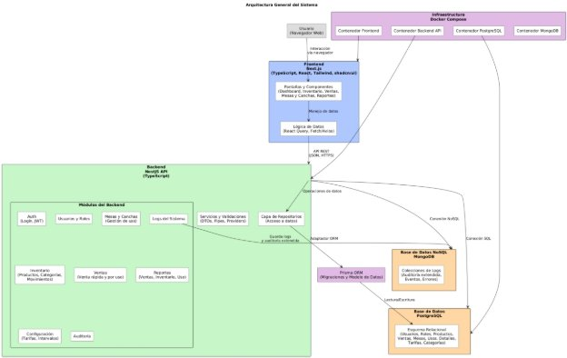

*Figura 10 Diagrama de arquitectura* 

A continuación se describen sus elementos principales. 

1. ***Usuario / Cliente*** 

El usuario accede al sistema mediante un navegador web, que actúa como cliente del frontend. Toda interacción ocurre a través de la interfaz gráfica del sistema, sin necesidad de instalaciones adicionales en el dispositivo del usuario. 

2. ***Frontend (Next.js, React, TypeScript)*** 

Representado en el diagrama como un contenedor azul, el frontend se encarga de: 

1. Interfaz gráfica y pantallas 

   Incluye todas las vistas del sistema, como: 

- Dashboard 
- Control de mesas y canchas 
- Inventario 
- Ventas 
- Reportes 
2. Lógica de datos 

   Utiliza herramientas como: 

- React Query para manejo de caché y sincronización con la API 
- Fetch/Axios para solicitudes HTTP 
- Manejo de estado local y global según necesidad 

El frontend no interactúa con la base de datos directamente, sino que se comunica únicamente mediante la API REST del backend. 

3. ***Backend (API NestJS)*** 

El backend, representado en verde, es el núcleo del sistema donde reside la lógica de negocio. La API está construida con NestJS y organizada en módulos independientes, cada uno responsable de un conjunto de funcionalidades. 

1. Módulos del Backend 

   Incluye módulos para manejar: 

- Autenticación (JWT) 
- Usuarios y roles 
- Mesas y Canchas 
- Caja 
- Inventario (productos, categorías, movimientos) 
- Ventas 
- Reportes 
- Configuración (tarifas e intervalos) 
- Auditoría 
- Logs del sistema 

Esta estructura modular permite aislar responsabilidades, facilitando futuras extensiones o mantenimientos. 

2. Servicios y Validaciones 

   Incluyen: 

- DTOs 
- Pipes 
- Providers encargados de validar, transformar y procesar los datos que entran a la API. 
3. Capa de repositorios 

   Es la capa de acceso a datos del backend. 

   Define cómo se realizan las operaciones CRUD sobre las entidades del sistema, encapsulando las llamadas al ORM. 

4. ***Prisma ORM*** 

El ORM (Object-Relational Mapping) funciona como adaptador entre la API y la base de datos. Se encarga de: 

- Modelo de datos 
- Migraciones 
- Mapeo de entidades 
- Consultas SQL optimizadas 

Es el puente entre NestJS y PostgreSQL. 

5. ***Base de Datos (PostgreSQL y MongoDB)*** 

Representada en color naranja, contiene el esquema relacional del sistema, incluyendo entidades como: 

- Usuarios 
- Roles 
- Productos 
- Categorías 
- Subcategorías 
- Ventas 
- Mesas 
- Usos 
- Tarifas e intervalos 
- Auditoría 

Toda la información persistente del sistema se almacena aquí. 

Además de la base de datos relacional PostgreSQL, el sistema dispone de una base de datos NoSQL MongoDB, utilizada específicamente para el almacenamiento de logs del sistema, auditoría extendida y métricas técnicas. 

MongoDB no participa en las transacciones de negocio (inventario, ventas, usos de mesa/cancha), sino que funciona como un repositorio independiente para datos semiestructurados de alto volumen, consumido principalmente por el módulo de logs y las herramientas de monitoreo. 

6. ***Infraestructura con Docker Compose*** 

Toda la aplicación se ejecuta dentro de un entorno contenerizado mediante Docker Compose, que define tres servicios principales: 

- Contenedor de Frontend 
- Contenedor de Backend API 
- Contenedor de PostgreSQL 
- Contenedor de MongoDB 

El uso de contenedores garantiza: 

- Fácil despliegue 
- Entornos reproducibles 
- Aislamiento entre servicios 
- Compatibilidad entre máquinas de desarrollo y producción 
- Las comunicaciones son internas por red Docker. 
- El usuario solo interactúa con frontend. 
7. ***Flujo General de Interacción*** 

El flujo principal del sistema es: 

1. El usuario interactúa con el frontend desde el navegador. 
1. El frontend envía solicitudes a la API (NestJS) mediante JSON/HTTPS. 
1. El backend procesa la lógica, valida datos y consulta repositorios. 
1. Prisma ORM traduce las operaciones del backend a consultas SQL. 
1. PostgreSQL almacena o recupera los datos solicitados. 
1. La API devuelve los resultados al frontend, que los presenta al usuario. 

Este ciclo asegura un funcionamiento modular, seguro y eficiente. 

2. **Diagrama de Clases** 

El diagrama de clases mostrado en la [Figura 11,](#_page156_x69.00_y286.00) representa la estructura principal del modelo de dominio del sistema, donde incluye las entidades fundamentales, sus atributos, sus métodos más relevantes (enlazados a los casos de uso) y las relaciones entre ellas. Este modelo sirve como base conceptual para la implementación en el backend y garantiza trazabilidad directa con los requerimientos funcionales y casos de uso. 

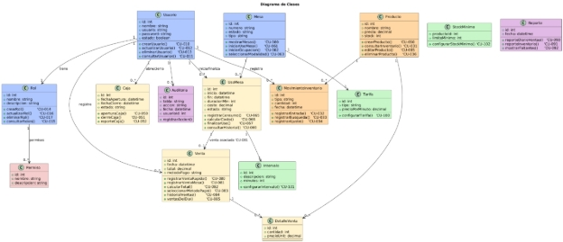

*Figura 11 Diagrama de clases* 

Para facilitar la comprensión, a continuación se describen las clases agrupadas por temática. 

1. ***Gestión de Usuarios, Roles y Permisos*** 
1. **Usuario** 

Representa a cualquier persona que opera el sistema, incluye atributos esenciales como nombre, usuario, contraseña y estado. Cada usuario está asociado a un único rol. 

**Relaciones:** 

- 1 Usuario → 1 Rol 
- 1 Usuario → \* Auditorías (acciones ejecutadas por el usuario) 
- 1 Usuario → \* Ventas (el usuario registra ventas) 
- 1 Usuario → \* MovimientoInventario (el usuario hace movimientos) 
- 1 Usuario → \* UsoMesa (inicia / finaliza usos) 
- 1 Usuario → \* Caja (abre/cierra caja) 

**Métodos (Vinculados a CU):** 

- crearUsuario() – CU-010 
- actualizarUsuario() – CU-012 
- eliminarUsuario() – CU-013 
- consultarUsuarios() – CU-011 
2. **Rol** 

Define el conjunto de permisos que un usuario puede tener. **Relaciones:** 

- 1 Rol → \* Permisos 

**Métodos:** 

- crearRol() – CU-014 
- consultarRoles() – CU-015 
- actualizarRol() – CU-016 
- eliminarRol() – CU-017 
3. **Permiso** 

Representa una acción específica que puede realizar un rol. **Métodos:** 

- crearPermiso() 
- actualizarPermiso() 
- eliminarPermiso() 
2. ***Gestión de Mesas, Usos y Tarifas*** 
1. **Mesa** 

Representa una mesa de billar o una cancha de tejo dentro del negocio. **Atributos:** id, número, estado, tipo. 

**Métodos:** 

- mostrarMesas() – CU-060 
- iniciarUsoMesa() – CU-061 
- iniciarOcupacion() – CU-062 
- seleccionarModalidad() – CU-063 

**Relaciones:** 

- 1 Mesa → \* UsoMesa 
- 1 Mesa → 1 Tarifa 
2. **UsoMesa** 

Modela un uso activo o finalizado de una mesa o cancha e incluye tiempos, costos y estado. **Métodos:** 

- iniciarUsoMesa() – CU-061 
- registrarConsumo() – CU-065 
- calcularCosto() – CU-066 
- finalizarUso() – CU-067 
- consultarHistorial() – CU-069 

**Relaciones:** 

- \* UsoMesa → 1 Intervalo 
- 1 UsoMesa → 0..1 Venta 
- 1 Mesa → \* UsoMesa 
- 1 Usuario → \* UsoMesa 
3. **Tarifa** 

Representa la tarifa asignada a un tipo de mesa o cancha. **Métodos:** 

- actualizarTarifa() – CU-100 
4. **Intervalo** 

Define una modalidad de uso fija en minutos (30, 60, 90, etc.). **Métodos:** 

- configurarIntervalo() – CU-101 
3. ***Inventario y Movimientos*** 
1. **Producto** 

Representa un artículo vendido o consumido en el negocio (bebidas, snacks, etc.). **Atributos:** nombre, precio, stock. 

**Métodos:** 

- crearProducto() – CU-030 
- consultarInventario() – CU-031 
- editarProducto() – CU-035 
- eliminarProducto() – CU-036 

**Relaciones:** 

- 1 Producto → 1 Subcategoría 
- 1 Subcategoría → 1 Categoría (relación indirecta) 
- 1 Producto → \* MovimientoInventario 
- 1 Producto → \* DetalleVenta 
2. **Categoría** 

Permite clasificar productos de forma general (licores, snacks, cigarrillos, etc.). **Relaciones:** 

- 1 Categoría → \* Subcategorías 
3. **Subcategoría** 

Permite subdividir una categoría en grupos más específicos (cervezas, gaseosas, snacks dulces, etc.). 

**Relaciones:** 

- 1 Subcategoría → \* Productos 
- 1 Subcategoría → 1 Categoría 
4. **MovimientoInventario** 

Registra cualquier cambio de stock: entrada, salida o ajuste. **Métodos:** 

- registrarEntrada() – CU-032 
- registrarBusqueda() – CU-033 
- registrarAjuste() – CU-034 
4. ***Ventas y Detalles*** 
1. **Venta** 

Representa una transacción final registrada en el sistema. **Métodos:** 

- registrarVentaRapida() – CU-080 
- registrarVentaMesa() – CU-081 
- calcularTotal() – CU-082 
- seleccionarMetodoPago() – CU-083 
- consultarHistorial() – CU-084 
- ventasDelDia() – CU-085 

Relaciones: 

- 1 Venta → \* DetalleVenta 
- 1 Venta → 0..1 UsoMesa 
- 1 Usuario → \* Venta 
2. **DetalleVenta** 

Línea individual dentro de una venta: producto, cantidad, precio unitario. 

5. ***Auditoría*** 

**5.2.5.1.   Auditoría** 

Registra cualquier acción crítica del usuario dentro del sistema: creación, modificación o eliminación de registros. 

**Métodos:** 

- registrarAccion() 

**Relaciones:** 

- 1 Usuario → \* Auditoria 
3. **Diagrama de Despliegue** 

El Diagrama de Despliegue mostrado en la [Figura 12 ](#_page164_x69.00_y676.00)ilustra cómo se distribuyen físicamente los componentes del sistema en la infraestructura de ejecución; representa los nodos involucrados, los contenedores utilizados, la comunicación entre capas y los puertos de red que intervienen en el funcionamiento. 

En este caso, el sistema se despliega utilizando Docker Compose, lo cual permite encapsular cada parte de la aplicación en un contenedor independiente, simplificando el despliegue, la portabilidad y el mantenimiento. 

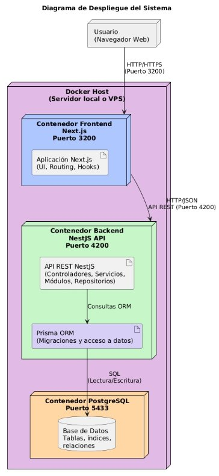

*Figura 12 Diagrama de despliegue* 

A continuación se detalla cada uno de los elementos del diagrama. 

1. ***Usuario (Navegador Web)*** 

El usuario interactúa con el sistema exclusivamente a través de un navegador web, este no requiere instalación local ni dependencias adicionales. 

- Se comunica con el frontend mediante HTTP o HTTPS. 
- Utiliza el puerto 3200, expuesto por el contenedor de Next.js. 
2. ***Docker Host (Servidor Local o VPS)*** 

Es la máquina donde se ejecutan todos los contenedores vía Docker Compose. Puede ser: 

- Una PC local 
- Un servidor dedicado 
- Una máquina virtual o VPS 

El Docker Host aloja los tres contenedores principales: 

1. Frontend (Next.js) – Puerto 3200 
1. Backend (NestJS API) – Puerto 4200 
1. Base de datos PostgreSQL – Puerto 5433 

Cada contenedor es completamente independiente pero se comunican entre sí mediante una red interna de Docker. 

3. ***Contenedor Frontend – Next.js (Puerto 3200)*** 

Este contenedor ejecuta la aplicación web desarrollada en Next.js. **Incluye:** 

- UI (interfaz de usuario) 
- Ruteo de páginas 
- Hooks 
- Lógica de consumo de la API 

**Comunicación:** 

- Recibe solicitudes del navegador del usuario 
- Realiza llamadas HTTP/JSON hacia el backend (puerto 4200) 

**Rol principal:** 

Renderizar la interfaz gráfica y enviar/recibir datos desde la API. 

4. ***Contenedor Backend – NestJS API (Puerto 4200)*** 

Este contenedor ejecuta la API REST del sistema. 

**Contiene:** 

- Controladores 
- Servicios 
- Módulos 
- Repositorios 
- Validaciones 
- Lógica de negocio 
- Integración con Prisma ORM 

**Comunicación:** 

- Recibe solicitudes JSON desde el Frontend (Puerto 4200) 
- Envía consultas ORM a Prisma 
- A través de Prisma, se comunica con PostgreSQL 

**Rol principal:** 

Procesar la lógica del negocio y exponer endpoints REST. 

5. ***Prisma ORM*** 

Aunque no es un contenedor independiente, Prisma se ejecuta dentro del contenedor Backend. **Funciones:** 

- Traducción entre objetos de la API y consultas SQL 
- Ejecución de migraciones 
- Garantizar integridad de datos 
- Acceso tipado al modelo relacional 

**Comunicación:** 

- Envía consultas SQL hacia PostgreSQL 
- Recibe resultados estructurados para la API 
6. ***Contenedor PostgreSQL – Puerto 5433*** 

Este contenedor aloja la base de datos relacional del sistema. **Contiene:** 

- Tablas 
- Índices 
- Relaciones 
- Constraints 
- Datos persistentes del negocio 

**Comunicación:** 

- Acepta consultas SQL provenientes de Prisma 
- Solo es accesible desde la red interna de Docker (no expuesto a Internet) 

**Rol principal:** 

Persistir toda la información del sistema (usuarios, ventas, inventario, usos de mesas, auditoría, etc.). 

7. ***Flujo General del Sistema*** 

**1.**  Usuario → Frontend (Next.js) 

- Protocolo: HTTP/HTTPS 
- Puerto: 3200 
- Acción: Solicita páginas e interactúa con la interfaz 
  - Frontend → Backend (NestJS) 
- Protocolo: HTTP/JSON 
- Puerto: 4200 
- Acción: Solicita datos, registros, ventas, inventario, sesiones, etc. 
  - Backend (NestJS) → Prisma ORM 
- Internamente: llamadas a repositorios ORM 
  - Prisma ORM → PostgreSQL 
- Protocolo: SQL 
- Puerto interno: 5433 
- Acción: Lectura/escritura de datos persistentes 
4. **Diagrama de Actividades** 
1. ***Flujo de Uso de Mesa / Cancha*** 

Este diagrama describe el flujo completo del proceso de venta asociada a un uso de mesa o cancha., representa las acciones del usuario (selección de uso finalizado, métodos de pago, confirmación) y las operaciones internas del sistema (cálculo del costo según CU-024, validación de stock, registro de venta, actualización de inventario y marcación del uso como facturado). El objetivo es mostrar cómo se coordinan las decisiones y validaciones necesarias para completar este caso de uso. 

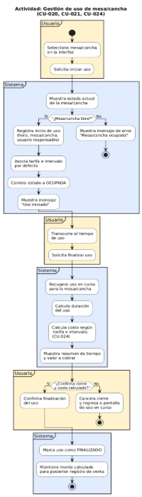

*Figura 13 Diagrama de actividad de gestión de uso de mesa/cancha* 

2. ***Flujo de Venta Rápida*** 

Describe el flujo de una venta directa sin uso asociado donde expone la selección de productos, validación de stock, cálculo del total, selección de método de pago y registro final en el sistema. 

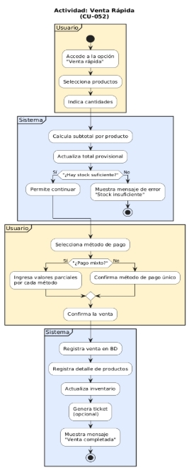

*Figura 14 Diagrama de actividades de venta rápida* 

3. ***Flujo de Venta por Uso*** 

Representa el proceso completo para iniciar el uso de una mesa/cancha, administrarlo y finalizarlo. Incluye la validación de disponibilidad, registro del inicio, cálculo del costo final y confirmación del cierre. 

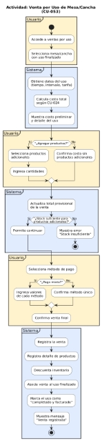

*Figura 15 Diagrama de actividades de ventas por uso* 

4. ***Flujo de Movimiento de Inventario*** 

Modela el proceso completo para registrar entradas, salidas y ajustes de productos, con validación de stock, actualización del inventario y registro del movimiento. 

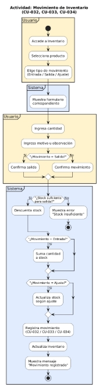

*Figura 16 Diagrama de actividades de movimiento de inventario* 

5. **Modelo Entidad Relación** 

El Modelo Entidad–Relación representado en la[ Figura 17](#_page175_x69.00_y544.00), ilustra la estructura lógica de la base de datos del sistema, define las entidades principales, sus atributos, las relaciones entre ellas y las claves foráneas que permiten mantener la integridad referencial. Este modelo sirve como base para la implementación del esquema en PostgreSQL y está alineado con los requisitos funcionales, el diagrama de clases y los casos de uso. 

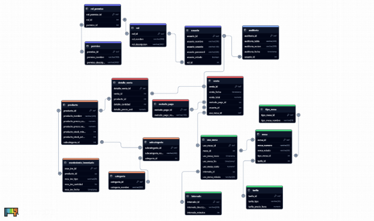

Figura 17 Modelo entidad relación 

Con el fin de mejorar la organización lógica, la seguridad y la mantenibilidad del sistema, el modelo entidad–relación implementa schemas de PostgreSQL para agrupar las entidades según el dominio funcional al que pertenecen. 

Esta estructura modular permite separar responsabilidades, facilitar el control de acceso por áreas del negocio y asegurar una mayor escalabilidad en futuras versiones del sistema. 

La base de datos se encuentra organizada en los siguientes schemas: 

1. ***Schema Auth*** 

El schema auth agrupa todas las entidades relacionadas con la gestión de usuarios y el control de acceso al sistema. 

Incluye la definición de roles, permisos y su asignación, así como la información principal de los usuarios. 

Este schema constituye la base del mecanismo de autenticación y autorización del sistema, garantizando que cada usuario acceda únicamente a las funcionalidades permitidas. 

A continuación se describen las tablas que lo componen: 

1. **Rol** 

Define el perfil que determina qué acciones puede realizar un usuario. **Atributos clave:** 

- rol\_nombre 
- rol\_descripcion 
2. **Permiso** 

Representa una acción específica que el sistema permite ejecutar. Los permisos se asignan a los roles para establecer niveles de acceso. 

3. **Rol\_Permiso** 

Tabla intermedia que implementa una relación N–N entre roles y permisos. Permite definir qué acciones tiene permitido ejecutar cada rol. 

4. **Usuario** 

Entidad principal que representa a las personas que acceden al sistema. **Relaciones:** 

- Cada usuario tiene un único rol 
- Cada rol puede tener múltiples permisos 
- Un usuario puede generar múltiples registros de auditoría 
2. ***Schema Core*** 

El schema core contiene las entidades transversales a todo el sistema. 

Su función es agrupar componentes que no pertenecen a un dominio funcional específico (mesas, ventas, inventario, etc.), sino que brindan soporte general a todas las operaciones. 

Actualmente, este schema incluye la entidad de auditoría, encargada de registrar las acciones realizadas por los usuarios en los diferentes módulos del sistema. 

A continuación se describe su estructura: 

**5.5.2.1.   Auditoria** 

La entidad Auditoría registra acciones relevantes ejecutadas por los usuarios dentro del sistema. 

Cada entrada permite rastrear modificaciones, operaciones críticas y eventos importantes, contribuyendo a la trazabilidad y seguridad del sistema. 

**Atributos:** 

- auditoria\_tabla (tabla afectada) 
- auditoria\_accion (acción realizada) 
- auditoria\_fecha 
- usuario\_id 

**Relación:** 

- 1 Usuario → \* Auditoría 
3. ***Schema Mesas*** 

El schema mesas agrupa todas las entidades relacionadas con la administración de mesas y canchas, así como la estructura necesaria para calcular el costo del uso según el tipo de mesa, tarifa y duración. 

Este módulo constituye el núcleo operativo para el control de tiempo y supervisión de disponibilidad dentro del negocio. 

A continuación se describen las entidades que conforman este schema. 

1. **Mesa** 

Representa mesas o canchas disponibles para alquilar. **Atributos relevantes:** 

- mesa\_numero 
- mesa\_estado 
- tipo\_mesa\_id 
- tarifa\_id 
2. **Tipo\_Mesa** 

Clasifica las mesas según su categoría (por ejemplo: billar, pool, tejo). Permite diferenciar configuraciones y tarifas dependiendo del tipo. 

3. **Tarifa** 

Define el precio asociado al uso de una mesa. Este valor puede corresponder al costo por hora o por minuto, de acuerdo con las reglas del negocio. 

4. **Intervalo** 

Define períodos fijos de tiempo utilizados para el cálculo del costo del uso de una mesa (por ejemplo: 30 o 60 minutos). 

Estos intervalos permiten parametrizar cómo se determina la duración y el valor total. 

5. **Uso\_Mesa** 

Registra los períodos de uso de una mesa o cancha, ya sea un uso activo o finalizado. **Incluye:** 

- fecha/hora de inicio 
- fecha/hora de fin 
- duración 
- costo calculado 
- estado 

**Relaciones:** 

- 1 Mesa → \* Uso\_Mesa 
- 1 Intervalo → \* Uso\_Mesa 
- 1 Uso\_Mesa → 0..1 Venta 

Este diseño permite controlar el tiempo utilizado y, posteriormente, calcular el costo de forma coherente con las tarifas e intervalos definidos. 

4. ***Schema Inventario*** 

El schema inventario agrupa las entidades responsables del control de productos, su clasificación y los movimientos que afectan el stock. 

Este módulo es fundamental para la operación diaria del negocio, ya que permite gestionar disponibilidad, costos, actualizaciones de existencias y categorización jerárquica de los productos. 

A continuación se describen las entidades que lo componen. 

1. **Categoría y Subcategoría** 

El inventario se organiza mediante una clasificación jerárquica compuesta por categorías y subcategorías, lo que permite agrupar productos de manera ordenada (por ejemplo: Bebidas → Cervezas). 

**Relaciones:** 

- 1 Categoría → \* Subcategoría 
- 1 Subcategoría → \* Producto 
2. **Producto** 

Entidad principal del módulo de inventario que representa cada uno de los bienes disponibles para la venta o consumo. 

**Atributos importantes:** 

- producto\_precio\_venta 
- producto\_precio\_costo 
- producto\_stock\_minimo 
- producto\_stock\_actual 

Cada producto pertenece a una subcategoría, permitiendo una correcta clasificación y organización dentro del inventario. 

3. **Movimiento\_Inventario** 

Registra las entradas, salidas y ajustes que afectan el stock de los productos. Incluye información sobre la cantidad, fecha y tipo de movimiento. 

**Relación:** 

- 1 Producto → \* Movimientos 

Esta entidad permite mantener un historial detallado y trazable de cada cambio en el inventario. 

5. ***Schema Ventas*** 

El schema ventas agrupa las entidades relacionadas con el registro de transacciones realizadas dentro del sistema. 

Incluye las ventas, sus detalles y los métodos de pago utilizados. Este módulo constituye el núcleo transaccional del sistema y está estrechamente vinculado con inventario y uso de mesa. 

A continuación se describen las entidades que lo componen. 

1. **Venta** 

Representa cada transacción final registrada en el sistema, incluyendo ventas rápidas, ventas asociadas a uso de mesa y ventas provenientes de consumos. 

**Atributos:** 

- venta\_total 
- venta\_fecha 
- metodo\_pago\_id 

**Relaciones:** 

- 1 Usuario → \* Ventas Cada usuario puede registrar múltiples ventas. 
- 1 Venta → 0..1 Uso\_Mesa Una venta puede estar asociada a un uso de mesa finalizado. 
- 1 Venta → \* Detalle\_Venta 

  Una venta contiene uno o varios productos vendidos. 

2. **Detalle\_Venta** 

Representa las líneas individuales que forman parte de una venta. 

Cada detalle incluye el producto vendido, la cantidad y el precio unitario aplicado. **Relaciones:** 

- 1 Venta → \* Detalle\_Venta 
- 1 Producto → \* Detalle\_Venta 

Esta estructura permite calcular el inventario vendido, totales por venta y auditoría de productos comercializados. 

3. **Método\_Pago** 

Tabla catálogo que define los métodos de pago disponibles en el sistema, como efectivo, tarjeta, transferencia o pagos mixtos. 

Permite estandarizar la forma en que las ventas son registradas y contabilizadas. 

6. ***Schema Public*** 

El schema public corresponde al esquema por defecto de PostgreSQL. 

En la arquitectura propuesta, su función es servir como contenedor para elementos globales o transversales que no pertenecen directamente a un dominio funcional específico. 

Debido a la separación modular del modelo de datos, las entidades principales del sistema se encuentran distribuidas en schemas especializados (auth, core, mesas, inventario, ventas). 

Por lo tanto, el schema public no almacena tablas de negocio en esta versión del sistema, preservándose únicamente para: 

- Definiciones generales o metadatos futuros 
- Funciones o vistas de uso global 
- Configuraciones compartidas a nivel de base de datos 

Esta decisión contribuye a una arquitectura más clara, segura y organizada, manteniendo public libre de entidades críticas y reservándolo para componentes de carácter transversal o complementario. 

7. ***Integridad Referencial del Modelo*** 

El modelo entidad–relación garantiza la integridad referencial entre todas las entidades del sistema, incluso cuando estas se encuentran distribuidas en distintos schemas. 

Las relaciones entre usuarios, inventario, ventas y uso de mesas están construidas mediante claves foráneas que aseguran consistencia, trazabilidad y cumplimiento de las reglas del negocio. 

El modelo garantiza: 

- Consistencia entre ventas y productos, asegurando que cada detalle de venta corresponda a un producto válido del inventario. 
- Relación controlada entre usos de mesa y ventas, permitiendo asociar una venta únicamente a un uso finalizado. 
- Auditoría rastreable por usuario, vinculando cada acción registrada con el usuario correspondiente del schema auth. 
- Coherencia en los movimientos de inventario, mediante claves foráneas que impiden registrar movimientos sobre productos inexistentes. 
- Control de stock previo a registrar ventas o consumos, evitando inconsistencias entre inventario y operaciones comerciales. 
- Validación de tipologías de mesa, tarifas e intervalos, mediante referencias directas a las entidades del schema mesas. 

Todas las relaciones incorporan claves foráneas claramente definidas, lo que evita la existencia de datos huérfanos y garantiza la integridad lógica del sistema en todos sus dominios funcionales. 

8. ***Almacenamiento NoSQL para logs y auditoría extendida*** 

El modelo entidad–relación descrito en esta sección abarca únicamente las entidades relacionales que residen en PostgreSQL y que soportan la operación transaccional del negocio (inventario, ventas, usos de mesas/canchas, caja, usuarios, etc.). 

Los logs del sistema, la auditoría extendida y otros eventos técnicos se almacenarán en una base de datos NoSQL MongoDB, mediante colecciones específicas que no forman parte del modelo relacional ni afectan la integridad referencial definida en este capítulo. Este almacenamiento NoSQL se considera un componente de infraestructura orientado a monitoreo y depuración, no al modelo de datos de negocio. 

6. **Diagrama de Grafo de Navegación** 

El grafo de navegación mostrado en la [Figura 18, ](#_page186_x69.00_y567.00)representa la estructura completa de pantallas del sistema y la forma en que el usuario se desplaza entre ellas; su objetivo es mostrar, de manera clara y visual, el flujo de navegación desde el inicio de sesión hasta cada uno de los módulos principales: mesas y canchas, inventario, ventas, reportes, configuración y administración de usuarios/roles. 

El grafo está organizado por paquetes funcionales, lo que refleja la modularidad del sistema y su alineación con los casos de uso y la arquitectura frontend. 

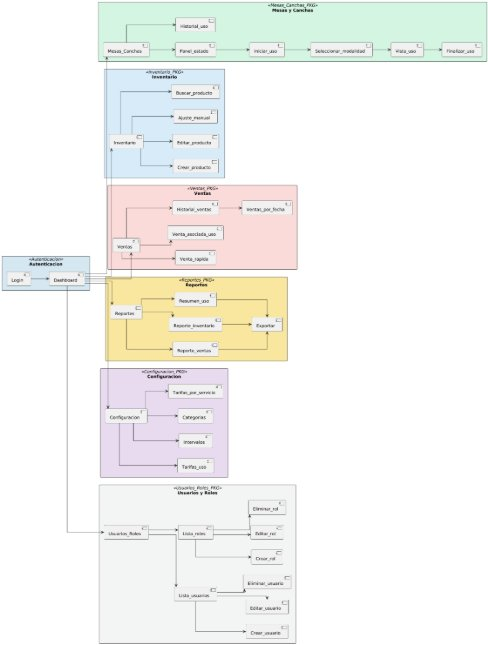

*Figura 18 Grafo de navegación* 

1. ***Autenticación*** 

Pantallas principales 

- Login 
- Dashboard 

El usuario inicia en la pantalla de Login, una vez autenticado, es dirigido al Dashboard, que funciona como menú central del sistema. 

2. ***Mesas y Canchas*** 

Este módulo representado en el paquete “Mesas\_Canchas\_PKG”, controla todo lo relacionado con el uso de mesas y canchas. 

**Pantallas clave:** 

- Mesas\_Canchas 
- Panel\_estado 
- Iniciar\_uso 
- Seleccionar\_modalidad 
- Vista\_uso 
- Finalizar\_uso 
- Historial\_uso 

**Navegación relevante:** 

- Desde Mesas\_Canchas se puede acceder al panel general o al historial. 
- Desde Panel\_estado se inicia el flujo de uso, que continúa paso a paso hasta Finalizar\_uso. 

Representa fielmente los casos CU-020, CU-021 y CU-024. 

3. ***Inventario*** 

Gerencia productos y movimientos de inventario, es representado por el paquete “Inventario\_PKG”. 

**Pantallas:** 

- Inventario 
- Crear\_producto 
- Editar\_producto 
- Ajuste\_manual 
- Buscar\_producto 

Navegación directa desde la pantalla principal de inventario hacia acciones de creación, edición, búsqueda y ajuste. 

4. ***Ventas*** 

Representado en el paquete “Ventas\_PKG “, incluye las ventas del sistema. **Pantallas:** 

- Ventas 
- Venta\_rapida 
- Venta\_asociada\_uso 
- Historial\_ventas 
- Ventas\_por\_fecha 

Desde Ventas se accede a la modalidad rápida o asociada a un uso de mesa/cancha. El historial permite consultar ventas por fecha, alineado con CU-052 y CU-053. 

5. ***Reportes*** 

Ubicada en el paquete “Reportes\_PKG “, incluye: 

- Reporte\_ventas 
- Reporte\_inventario 
- Resumen\_uso 
- Exportar 

Todas las variantes permiten exportar datos, de acuerdo con los requerimientos del sistema. 

6. ***Configuración*** 

Ubicado en el paquete “Configuracion\_PKG”. 

**Pantallas:** 

- Tarifas\_uso 
- Intervalos 
- Categorias 
- Tarifas\_por\_servicio 

Corresponde a la administración de parámetros clave del negocio (tarifas e intervalos utilizados para el cálculo del costo de usos). 

7. ***Usuarios y Roles*** 

Ubicado en el paquete “Usuarios\_Roles\_PKG”. **Pantallas:** 

- Lista\_usuarios 
- Crear\_usuario 
- Editar\_usuario 
- Eliminar\_usuario 
- Lista\_roles 
- Crear\_rol 
- Editar\_rol 
- Eliminar\_rol 

Permite la gestión administrativa de cuentas internas del sistema y su seguridad. 

6. **Arquitectura y Tecnologías** 

Con el fin de garantizar que el sistema sea robusto, mantenible y adecuado para el tamaño del negocio, se seleccionó un conjunto de tecnologías modernas y estables, así como una arquitectura modular que facilite la evolución del proyecto. 

El proyecto seguirá un esquema de versionado semántico y se mantendrá en un repositorio Git para permitir despliegues controlados. 

1. **Tecnologías Principales** 

*Tabla 92 Tecnologías principales del frontend* 

|**Frontend** |||
| - | :- | :- |
|**Next.js** |15\.0.x |Framework para el desarrollo de la interfaz web del sistema, permitiendo Server Components, optimización automática y rutas organizadas por módulos. |
|**TypeScript** |18\.3.x |Lenguaje fuertemente tipado para mayor mantenimiento y reducción de errores. |
|**TailwindCSS** |3\.4.x |Framework de estilos para construir una interfaz rápida, clara y adaptable a dispositivos como tabletas o portátiles. |
|**shadcn/ui** |Última versión estable |Librería de componentes reutilizables para formularios, tablas y elementos visuales. |
|**React Query (TanStack Query)** ||Manejo de datos, caché, estados de carga y sincronización con el backend. |

*Tabla 93 Tecnologías principales del backend* 

|**Backend** |||
| - | :- | :- |
|**NestJS** |11\.x |Framework modular para construir una API escalable basada en arquitectura por módulos. |
|**Node.js LTS** |20\.x |Entorno de ejecución para el backend.|
|**TypeScript** |5\.6.x |Lenguaje principal del lado del servidor. |
|**Prisma ORM** |5\.17.x |Herramienta de acceso a datos que facilita la gestión del modelo relacional y las migraciones. |
|**PostgreSQL** |15\.x |Base de datos relacional para almacenar usuarios, roles, inventario, ventas, uso de mesas y reportes. |
|**MongoDB** |7\.x |Base de datos NoSQL para logs del sistema, auditoría extendida y métricas técnicas. |

2. **Arquitectura General del Sistema** 

El sistema se desarrollará bajo una **arquitectura modular**, donde cada módulo corresponde directamente con los bloques funcionales definidos en los requisitos y casos de uso: 

- Módulo de Autenticación y Sesiones 
- Módulo de Usuarios y Roles 
- Módulo de Mesas y Canchas 
- Módulo de Inventario 
- Módulo de Ventas 
- Módulo de Reportes 
- Módulo de Configuración 
- Módulo de Auditoría 

Cada módulo estará dividido en controladores, servicios y acceso a datos, manteniendo una separación clara entre lógica, presentación y persistencia. 

El frontend utilizará una estructura por carpetas de funcionalidad, alineada con estos mismos módulos, facilitando el mantenimiento y la integración con el backend. 

La capa de acceso a datos se implementa exclusivamente mediante Prisma ORM, actuando como adaptador entre los repositorios del backend y la base de datos PostgreSQL. Esto garantiza tipado estático, migraciones controladas y un modelo de datos sincronizado con el MER. 

A nivel de persistencia, el sistema distingue entre: 

- **Datos transaccionales** (usuarios, inventario, ventas, usos de mesa/cancha, caja, auditoría básica), gestionados mediante Prisma ORM sobre PostgreSQL, garantizando integridad referencial y consistencia del modelo relacional. 
- **Datos de logs y auditoría extendida**, gestionados mediante un módulo específico del backend que utiliza MongoDB como base de datos NoSQL. Este módulo se integra con NestJS utilizando Mongoose/@nestjs/mongoose y almacena eventos de ejecución, 

  errores, trazas técnicas y métricas, sin impactar el rendimiento de las operaciones transaccionales. 

3. **Patrones de Diseño a Implementar** 

Para asegurar claridad, mantenibilidad y coherencia interna, se aplicarán los siguientes patrones: *Tabla 94 Patrones de diseño* 

|**Patrones de diseño** ||
| - | :- |
|**Arquitectura en capas (Controller → Service → Repositorio)** |Separa la lógica del negocio, la entrada/salida y el acceso a datos. |
|**Patrón Repositorio** |Permite desacoplar la base de datos del resto del sistema y facilita el testeo. |
|**DTOs (Data Transfer Objects)** |Para validar y estructurar datos de entrada y salida del backend. |
|**Validación con class-validator o Zod** |Asegura que los datos enviados al servidor sean correctos. |
|**Componentes presentacionales y contenedores en el frontend** |Los componentes visuales se separan de la lógica que maneja datos. |
|**Custom Hooks en el frontend (useInventario, useVentas, etc.)** |Para reutilizar la lógica y mantener el código organizado. |

4. **Librerías Adicionales** 

*Tabla 95 Librerías frontend* 

|**Frontend** |||
| - | :- | :- |
|**react-hook-form** ||Para formularios |
|**Zod** |3\.x |Para validaciones |
|**Axios** |1\.x |Para solicitudes HTTP |
|**Recharts** |2\.8.x |Para reportes gráficos |
|**lucide-react** |0\.368.x |Para iconografía |
|**react-hot-toast** ||Para notificaciones |

*Tabla 96 Librerías backend* 

|**Backend** |||
| - | :- | :- |
|**@nestjs/config** ||Para manejo de variables de entorno |
|**bcrypt** |5\.x |Para encriptación de contraseñas |
|**@nestjs/jwt** |11\.x |Para manejo de sesiones |
|**helmet, cors y throttler** |7\.x |Para seguridad |
|**winston** |3\.11.x |Para logs del sistema |

|**jest** ||Para pruebas |
| - | :- | - |
|**Mongoose / @nestjs/mongoose** ||Librería de mapeo objeto–documento para integrar MongoDB en los módulos de NestJS encargados del manejo de logs. |

5. **Infraestructura y despliegue** 

Para asegurar la portabilidad y facilidad de instalación en el entorno del negocio: 

- Se utilizará **Docker** para contenerizar la API, el frontend y la base de datos. 
- El sistema definirá un archivo docker-compose.yml con los servicios: 
  - API (NestJS) 
  - Web (Next.js) 
  - Base de Datos (PostgreSQL) 
  - Base de datos NoSQL (MongoDB) para logs y auditoría extendida 
- Prisma gestionará las **migraciones** de la base de datos. 
- Se usarán archivos .env diferenciados para entornos: desarrollo y producción. 
7. **Metodología de Desarrollo** 
1. **Planificación** 

El desarrollo del sistema seguirá una **Metodología Incremental Evolutiva Guiada por Versiones (MIEGV)**. 

Esta metodología divide el proyecto en versiones consecutivas que agregan funcionalidad y refinan las características existentes. La planificación se realizará a partir de: 

- Una lista general de módulos del sistema. 
- Objetivos por versión. 
- Tareas desglosadas en GitHub Project mediante issues. 
- Priorización simple basada en necesidad operativa del negocio. 

La planificación inicial contempla tres versiones principales: 

1. **Versión 1:** 
- Control de mesas y canchas 
- Cálculo de uso 
- Cierre de uso y costo 
- Primera versión del dashboard 
- Autenticación básica 
2. **Versión 2:** 
- Inventario 
- Movimiento de inventario 
- Venta rápida 
- Venta por uso (sin consumos adicionales si no deseas incluirlo ya) 
- Integración de inventario con ventas 
3. **Versión 3:** 
- Reportes básicos 
- Configuración (tarifas, intervalos, tipos de mesa) 
- Módulo de usuarios y roles 
- Auditoría 
- Integración del módulo de logs y auditoría extendida sobre MongoDB (almacenamiento NoSQL), incluyendo consultas básicas y soporte para análisis posterior. 

Cada versión incluirá mini - etapas: análisis → diseño → construcción → pruebas → implantación. 

2. **Análisis** 

La fase de análisis consiste en: 

- Recolectar información del negocio mediante la entrevista a Carolina. 
- Realizar visitas al local para observar el flujo operativo. 
- Identificar procesos manuales que pueden digitalizarse. 
- Definir los requisitos funcionales y no funcionales correspondientes a cada versión. 
- Identificar restricciones técnicas del entorno donde se usará el sistema. 

El análisis se documentará en el mismo archivo, y cada iteración permitirá refinar los requisitos previos. 

3. **Diseño** 

En esta fase se realizarán los siguientes elementos: 

- Modelado de datos (tablas y relaciones). 
- Diagramas de actividades para los flujos principales. 
- Diseño de interfaz centrado en la facilidad de uso. 
- Arquitectura técnica simple, adecuada para un proyecto indie, con énfasis en modularidad. 
- Prototipos básicos de pantallas creados en herramientas como Figma si es necesario. 

Cada versión tendrá su propio conjunto de diseños, que evolucionarán conforme crezcan las funcionalidades. 

4. **Construcción** 

La construcción se realizará de forma incremental: 

- Implementación de funcionalidades según las tareas definidas en GitHub. 
- Revisión continua del código mediante commits frecuentes. 
- Uso de ramas en Git para separar funcionalidades y evitar conflictos. 
- Pruebas manuales al terminar cada tarea. 
- Integración gradual de módulos. 

La prioridad será siempre mantener una versión estable y funcional del sistema. Cada funcionalidad se implementará en ramas separadas, integrándose mediante pull requests dentro del repositorio GitHub. 

5. **Implantación** 

Cada versión del sistema será instalada y probada directamente en el entorno interno del negocio. El proceso de implantación incluye: 

- Configuración inicial del sistema. 
- Pruebas con datos reales de operación. 
- Observación de la interacción de Carolina. 
- Corrección de problemas detectados. 
- Ajuste de parámetros como tarifas, intervalos de tiempo, productos, roles, etc. 

La implantación será progresiva, iniciando con la funcionalidad más crítica: el control de mesas y canchas. Esta utiliza contenedores Docker para garantizar un entorno controlado y reproducible tanto en desarrollo como en producción. 

6. **Mantenimiento** 

El mantenimiento se realizará de forma continua: 

- Corrección de errores descubiertos durante la operación. 
- Mejoras solicitadas por los administradores. 
- Optimización del rendimiento del sistema. 
- Ajustes a la interfaz según la experiencia real de uso. 
- Incorporación futura de mejoras sobre las funcionalidades existentes, como optimización de reportes, nuevas métricas, mejoras en el control de inventario y refinamientos en la interfaz. 

Al ser un proyecto propio, el mantenimiento seguirá un ciclo flexible basado en necesidades reales y disponibilidad del desarrollador. 

8. **Manual de Usuario** 
9. **Instrucciones de Instalación y Código** 
201 
